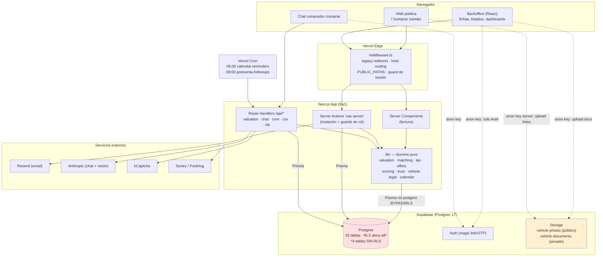
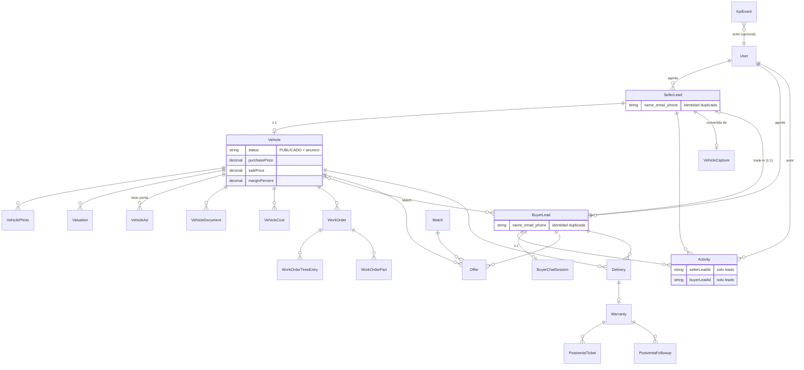
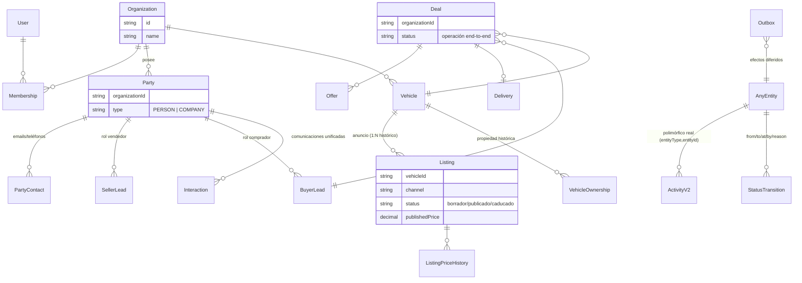
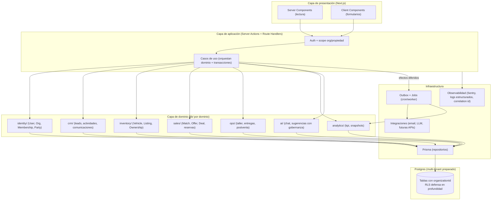

<!-- ───────────────────────────────────────────────────────────────────────── -->
<!--  CABECERA DE ESTADO (añadida en el PR de documentación y gobierno de Fase 0) -->
<!-- ───────────────────────────────────────────────────────────────────────── -->

> **Estado: HISTÓRICO.** No es fuente de verdad del estado actual.
>
> - **Documento:** auditoría de arquitectura y escalabilidad.
> - **Fecha original:** 2026-07-10 · **Commit auditado:** `0ae8631` (previo a Fase 0).
> - **Propósito original:** diagnóstico de arquitectura y plan de evolución.
> - **Por qué es histórico:** este documento **precede** a la implementación de Fase 0. Sus
>   hallazgos críticos ya han sido **resueltos**: `SEG-01` (RLS en 4 tablas) por `5ce93d6`;
>   `NEG-01/02/03` (atomicidad) por `18d3376`/`531b2df`/`fadf828`; `SEG-02` (Storage) por
>   `4f52f8d`/`e607f2a`/`1b0f6fb`; el historial de migraciones por `00be57b`.
> - **Sustituido por (estado actual):**
>   - Estado de Fase 0 → [`../architecture/fase-0-final-state.md`](../architecture/fase-0-final-state.md)
>   - Decisiones → [`../architecture/architecture-decisions.md`](../architecture/architecture-decisions.md)
>   - Evolución futura (Fase 1) → [`../architecture/fase-1-readiness.md`](../architecture/fase-1-readiness.md)
> - **Conservado por trazabilidad:** su análisis y su razonamiento siguen siendo la base del
>   diseño de Fase 1. Los hallazgos `SEG-03/04/05/06`, `DATOS-01/02/03`, `ANALIT-*`, `ARQ-*`,
>   `OPS-*`, `PERF-*`, `CAL-*`, `IA-01` son **de Fase 1+** y siguen abiertos como análisis.
> - **Advertencia:** los comandos y consultas de verificación en vivo que aparecen en el cuerpo
>   fueron **read-only** contra staging/producción en su momento; **no** deben re-ejecutarse sin
>   autorización y sin confirmar el `project_ref`.

---

# Auditoría de Arquitectura, Escalabilidad y Preparación Futura — Campers Nova CRM

> **Naturaleza de este documento.** Diagnóstico técnico. No se ha modificado código, esquema, políticas ni configuración. El entregable es exclusivamente este informe. La implementación del plan de acción queda pendiente de aprobación.

---

## 6.1. Alcance y cobertura de la auditoría

|                      |                                                                                                                                                                                               |
| -------------------- | --------------------------------------------------------------------------------------------------------------------------------------------------------------------------------------------- |
| **Fecha**            | 2026-07-10                                                                                                                                                                                    |
| **Repositorio**      | `campernova-crm`                                                                                                                                                                              |
| **Rama / commit**    | `main` · `0ae8631` (working tree limpio)                                                                                                                                                      |
| **Stack verificado** | Next.js 14.2.35 (App Router) · TypeScript strict · Prisma 6.19 · PostgreSQL 17 (Supabase, Frankfurt) · Vercel `fra1` · Resend · Sentry · PostHog · hCaptcha · Anthropic SDK (chat + visión)   |
| **Volumen**          | 595 archivos versionados · ~48,5k líneas TS/TSX (sin tests) · 29 modelos Prisma · 48 enums · 25 migraciones · ~60 server actions en ~25 archivos · 9 route handlers · 61 tests Vitest + 1 e2e |

### Método efectivo

1. **Inventario** del repositorio mediante 3 agentes de exploración en paralelo (estructura + modelo de datos; superficies de seguridad; lógica de negocio/tests/calidad).
2. **Verificación en base de datos de STAGING** (`iatuhydsfwoeprpbklod`), en modo **estrictamente solo lectura**, vía el MCP de Supabase: estado de RLS por tabla, `pg_policies` (public + storage), `pg_indexes`, `storage.buckets`, reglas `onDelete` de todas las FK, roles con `BYPASSRLS`, y el **advisor de seguridad de Supabase**. **Producción (`bbmglaatlyilxutzomxd`) no se consultó.** El `project_ref` se verificó antes de cada consulta.
3. **Lectura directa** de los archivos de mayor densidad de riesgo para corroborar los hallazgos críticos sin depender de resúmenes: `schema.prisma` completo, la migración de RLS, `ofertas/actions.ts`, `entregas/actions.ts`, `lib/postventa/create-warranty.ts`, `lib/auth.ts`, `captaciones/actions.ts`, `middleware.ts`, las rutas del chat, `search-actions.ts`, `lib/kpi/flow.ts`, `lib/kpi/emit.ts`, `lib/db.ts`, `documents-section.tsx`.

### Tabla de cobertura

| Área                              | Elementos encontrados                                     | Inspeccionados                                               | Cobertura          | Limitaciones                                      | Confianza                     |
| --------------------------------- | --------------------------------------------------------- | ------------------------------------------------------------ | ------------------ | ------------------------------------------------- | ----------------------------- |
| Estructura / arquitectura         | ~886 archivos ts/tsx                                      | Estructura completa + lectura profunda de puntos calientes   | Alta               | Fichas de >1000 líneas leídas parcialmente        | Alta                          |
| Modelo de datos                   | 29 modelos, 48 enums, 25 migraciones, FKs/índices en vivo | Schema completo + FKs/índices verificados en staging         | Muy alta           | —                                                 | Muy alta                      |
| Seguridad — autorización          | lib/auth + ~60 actions + 9 handlers                       | Guards de todas las actions; lectura directa de las críticas | Alta               | No se ejecutó pentest dinámico                    | Alta                          |
| Seguridad — RLS / storage         | RLS por tabla, políticas, buckets (staging)               | Verificado en vivo (staging) + advisor Supabase              | Muy alta (staging) | **Prod no verificado**; puede divergir de staging | Alta (staging) / Media (prod) |
| Lógica de negocio / transacciones | ~25 archivos de actions                                   | Flujos críticos leídos línea a línea                         | Alta               | —                                                 | Alta                          |
| CRM / workflows                   | máquinas de estado + fichas + timeline                    | Máquinas de estado leídas; fichas parcial                    | Media-alta         | Recorrido UI no ejecutado (auth-gated)            | Media-alta                    |
| Marketplace                       | lib/public-catalog, lib/ads, seo                          | Modelo Vehicle/VehicleAd + catálogo público                  | Media-alta         | —                                                 | Alta                          |
| Analítica / IA                    | lib/kpi/\* (16), lib/chat, lib/rv-suggest, lib/ads        | Patrón de lectura + emit + flow + chat                       | Alta               | —                                                 | Alta                          |
| Testing                           | 61 tests + 1 e2e                                          | Inventario + patrón mockDb + gaps                            | Alta               | No se ejecutó la suite en esta sesión             | Alta                          |
| Rendimiento / operación           | queries, índices, crons, Sentry                           | Índices en vivo + patrón de queries + config                 | Media-alta         | Sin datos de carga real; backups no verificables  | Media                         |

### Áreas revisadas parcialmente o no verificables

- **Producción**: por decisión de alcance (solo lectura sobre staging), **el estado real de RLS, políticas de storage e índices de PRODUCCIÓN no se ha verificado**. Staging se construyó "desde el código" (según `CLAUDE.md`), por lo que es un buen proxy del comportamiento que producen las migraciones, pero **la configuración manual del panel de Supabase — típicamente las políticas de `storage.objects` — puede diferir entre entornos**. Marcado como tal donde aplica.
- **Backups / restauración / DR**: gestionados por Supabase, no verificables desde el repositorio.
- **Recorridos autenticados del backoffice**: no ejecutables en esta sesión (requieren sesión). Las conclusiones de UI derivan de lectura de código, no de ejecución.
- **Fan-out multi-agente**: se diseñó y lanzó un workflow de auditoría profunda de 12 áreas con verificación adversarial, pero **falló íntegramente por un límite de gasto mensual de la cuenta** (no por el código). Se compensó con lectura directa de los archivos de mayor riesgo y la verificación en staging. Esto no reduce la confianza de los hallazgos críticos (todos corroborados a mano), pero sí implica que la cobertura de los hallazgos de severidad media/baja es algo menos exhaustiva de lo planificado.

### Nivel de confianza global

**Alto** para seguridad de base de datos (verificada en vivo), modelo de datos, y los flujos transaccionales críticos (leídos línea a línea). **Medio-alto** para el resto. La principal incertidumbre es el **estado de seguridad de producción** (RLS/storage), que recomiendo verificar como primer paso de cualquier actuación.

---

## 6.2. Resumen ejecutivo

**Campers Nova es un CRM interno single-tenant, en producción, técnicamente por encima de la media de proyectos de su tamaño.** Está construido con criterio: TypeScript estricto (prácticamente cero `any`), lógica de negocio pura y testeada aislada de Prisma, máquina de estados central para las entidades núcleo, guards de autorización server-side consistentes, decisiones documentadas en ADRs, CI que bloquea merges y disciplina de migraciones additivas. No es "pantallas pegadas a la base de datos"; es un **monolito modular razonablemente sano**.

Sin embargo, la distancia entre _lo que es hoy_ y _la visión_ (SaaS multiempresa + marketplace + plataforma sectorial) está condicionada por **cuatro decisiones estructurales ausentes** —multi-tenant, entidad Persona/Organización, separación Vehículo/Anuncio, aislamiento de datos por propietario— que **hoy son baratas de preparar y caras de posponer**. Y hay **un fallo de seguridad crítico ya presente en producción-equivalente** que debe corregirse de inmediato, independientemente de la visión.

**Nivel de madurez:** _producto interno sólido en fase de consolidación_, con fundamentos correctos pero preparación para plataforma todavía embrionaria.

### Fortalezas principales

1. **Lógica de negocio pura y testeada** con inyección de dependencias (`lib/valuation`, `lib/matching`, `lib/scoring`, `lib/vehicle-legal`, `lib/trust-passport`, `lib/taller/scheduling`) — 43 de 61 tests cubren este núcleo.
2. **Autorización server-side coherente** vía guards semánticos (`lib/auth.ts`): todas las server actions revisadas pasan por `requireAgente`/`requireAdmin`/`requireCanX`. No hay operaciones críticas de mutación sin guard de rol.
3. **RLS deny-all como red de seguridad** sobre PostgREST + acceso a datos exclusivamente vía Prisma (rol `postgres`, `BYPASSRLS`); **ningún uso de `service_role` en el cliente**; separación limpia de secretos (`NEXT_PUBLIC_*` no contiene material sensible).
4. **Modelo relacional bien normalizado** para el negocio actual: enums en vez de texto libre, FKs con `onDelete` deliberado, índices compuestos correctos, histórico de tasaciones (`Valuation`) y timeline (`Activity`).
5. **Disciplina de ingeniería**: TS strict, `commitlint`, hooks, CI bloqueante (`typecheck`+`lint`+`test`), ADRs, staging separado, migraciones additivas.

### Debilidades principales

1. **Cuatro tablas sin RLS expuestas a la API pública** (crítico, ver Hallazgo SEG-01).
2. **Integridad transaccional con costuras** en 3 flujos de dinero/stock (reserva de oferta, garantía de entrega, conversión de captación).
3. **Sin ningún cimiento multi-tenant ni aislamiento de datos por propietario** (cualquier agente ve/edita todo).
4. **Modelo de identidad plano**: no existe `Persona`/`Contacto` unificado; comprador y vendedor son entidades separadas que duplican a la misma persona.
5. **Vehículo y anuncio acoplados**: la "publicación" es un estado del vehículo, no una entidad `Anuncio`/`Listing` con ciclo de vida propio — bloquea el marketplace.

### Puntuaciones (0-10, justificadas)

| Dimensión         |    Nota | Justificación (evidencia)                                                                                                                                                                                                                                       |
| ----------------- | ------: | --------------------------------------------------------------------------------------------------------------------------------------------------------------------------------------------------------------------------------------------------------------- |
| Arquitectura      | **6.5** | Monolito modular sano; `lib/` puro + testeado, ADRs. Penaliza: máquinas de estado dispersas (Delivery/WorkOrder inline), 3 sistemas de componentes conviviendo, fichas de 1456/1141 líneas.                                                                     |
| Modelo de datos   | **5.5** | Normalizado, buenos índices/FKs/enums, histórico parcial. Penaliza: sin Persona/Organización/Anuncio/Operación como entidades; `Activity` polimórfico solo sobre leads; 8 campos `Json` sin validación en DB.                                                   |
| Seguridad         | **4.0** | Buenos cimientos (guards, RLS deny-all, secretos). **Hunde la nota**: 4 tablas expuestas por RLS (crítico), políticas de storage no versionadas, sin rate-limiting perimetral, RGPD incompleto.                                                                 |
| Escalabilidad     | **6.0** | Postgres + índices correctos aguantan 10-100k registros. Fallará primero en analytics sin caché y `kpi_events` sin poda. Sin bloqueos estructurales.                                                                                                            |
| Multi-tenancy     | **1.5** | Inexistente: sin `organizationId`, sin membresías, sin scoping por propietario. Cero preparación (no es un defecto _hoy_, sí un cimiento ausente).                                                                                                              |
| Mantenibilidad    | **6.5** | TS strict, ~0 `any`, tests de lógica pura, ADRs. Penaliza: duplicación de componentes/estados y fichas gigantes.                                                                                                                                                |
| Testing           | **5.0** | Fuerte en lógica pura (43 tests). Penaliza: cero e2e de backoffice, cero tests de los flujos transaccionales críticos (ofertas, captación), cero tests de RLS/permisos/concurrencia.                                                                            |
| Observabilidad    | **4.5** | Sentry + PostHog configurados. Penaliza: sin logs estructurados, sin correlation IDs, sin alertas de negocio/jobs, sin health checks.                                                                                                                           |
| Prep. Marketplace | **3.5** | SEO/catálogo público real y bueno. Penaliza: vehículo = anuncio; sin `Listing`, sin usuarios externos, sin moderación/historial de precios.                                                                                                                     |
| Prep. CRM         | **6.5** | Timeline, próxima acción, temperatura, motivo de pérdida, matching, scoring, dedup. Penaliza: sin vista Persona 360 unificada; comunicaciones entrantes (llamadas/emails) no registradas.                                                                       |
| Prep. SaaS        | **2.0** | Depende de multi-tenancy (1.5) + facturación + config por org, todo ausente.                                                                                                                                                                                    |
| Prep. IA          | **6.0** | Tool-use validado con Zod, tracking de tokens/coste/modelo en chat, transacción en creación de lead, visión para taxonomía/anuncios. Penaliza: sin versión de prompt, sin nivel de confianza, sin capa sugerencia/aprobación para acciones IA de mayor impacto. |

**Preparación global: 5.0 / 10 — "evolucionable, con una corrección crítica inmediata y tres cimientos a preparar antes de escalar".**

> **Criterio de la nota global (no es una media aritmética).** El sistema resuelve _bien_ su problema actual (≈6,5 en las dimensiones operativas), pero la preparación para la visión está _limitada por su eslabón más débil estructural_: multi-tenancy (1,5) y el modelo de identidad/anuncio. Como la visión exige explícitamente SaaS + marketplace, esas dimensiones pesan. Y como existe un fallo de seguridad crítico _activo_, la nota no puede ser "buena" sin más. El 5,0 refleja: **base buena, techo bajo hasta preparar cimientos, y un incendio que apagar hoy.**

### Recomendación principal y veredicto

**Evolucionar, no rehacer.** No hay evidencia de que reescribir tenga menor riesgo/coste que evolucionar: el núcleo (lógica pura testeada, modelo relacional, autorización) es reutilizable casi en su totalidad. La secuencia correcta es:

1. **Ahora (Fase 0):** cerrar el fallo crítico de RLS y coser las 3 costuras transaccionales de dinero/stock. Días, no semanas.
2. **Antes de añadir capacidades de plataforma (Fase 1):** preparar los cuatro cimientos —`organizationId` en las tablas de negocio, entidad `Party`/`Persona`, separación `Vehicle`/`Listing`, tabla de auditoría/outbox— con migraciones additivas y compatibilidad temporal, sin activar aún toda la funcionalidad.
3. **Después:** construir marketplace y SaaS sobre esos cimientos.

**Consecuencia de seguir desarrollando sin corregir fundamentos:** cada nueva entidad de negocio que se añada sin `organizationId` y sin `Party` multiplica el coste de la futura migración multi-tenant y de la unificación de identidades (más filas a re-mapear, más FKs que reapuntar, más código que reescribir). Y el fallo de RLS deja datos de negocio (importes de ofertas, PII de calendario, teléfonos de captación) accesibles con la clave pública **hoy**.

---

## 6.3. Mapa de la arquitectura actual

**Es un monolito Next.js modular desplegado en Vercel**, con la lógica de negocio en `lib/`, mutaciones vía Server Actions, lectura vía Server Components, y acceso a datos exclusivamente por Prisma. Supabase aporta Auth (magic link), Postgres y Storage. No hay backend separado, ni colas, ni workers; los procesos "asíncronos" son crons diarios de Vercel y efectos _fire-and-forget_ dentro del mismo request.

**Puntos de entrada:** middleware (todas las rutas salvo estáticos) → Server Components / Server Actions / Route Handlers.
**Fronteras de confianza:** (1) el middleware separa público de autenticado; (2) los guards de `lib/auth.ts` separan roles dentro del backoffice; (3) RLS separa el acceso PostgREST (anon) del acceso Prisma (`postgres`). **La frontera (3) tiene una brecha** (4 tablas sin RLS).
**Procesos síncronos:** todo el flujo de request. **Asíncronos:** 2 crons diarios + efectos _fire-and-forget_ (emails, `emitKpiEvent`, `runAndSaveAutoValuation`, `recalculateMatches*`) que se ejecutan dentro del request pero cuyo fallo se traga en silencio.
**Zonas de acoplamiento notables:** máquina de estados de Delivery/WorkOrder embebida en sus `actions.ts`; "publicación" acoplada a `Vehicle.status`; analítica leyendo directamente tablas operativas.

---

## 6.4. Inventario de dominios

| Dominio                            | Estado                  | Responsabilidad                     | Entidades / módulos actuales                                                                        | Problemas                                                                                                       | Madurez    | Recomendación                                                         |
| ---------------------------------- | ----------------------- | ----------------------------------- | --------------------------------------------------------------------------------------------------- | --------------------------------------------------------------------------------------------------------------- | ---------- | --------------------------------------------------------------------- |
| **Identidad y acceso**             | Real                    | Auth + roles                        | `User`, `lib/auth.ts`, Supabase Auth                                                                | Rol global (no por org); sin membresías; sin auditoría de acciones admin                                        | Media      | Preparar `Organization`/`Membership` (Fase 1/3)                       |
| **Organizaciones**                 | **Ausente (futuro)**    | Aislamiento multiempresa            | —                                                                                                   | No existe                                                                                                       | Nula       | Introducir `organizationId` como cimiento (Fase 1), activar en Fase 3 |
| **CRM / Contactos**                | Implícito disperso      | Relación con clientes               | `SellerLead`, `BuyerLead`, `Activity`, `lib/next-action`, `lib/lead-temperature`, `lib/buyer-dedup` | Sin `Party`/`Persona` unificada; comprador≠vendedor duplican identidad; comunicaciones entrantes no registradas | Media      | Introducir `Party` (Fase 1)                                           |
| **Vehículos**                      | Real                    | Inventario físico + ficha técnica   | `Vehicle`, `VehiclePhoto`, `VehicleDocument`, `lib/rv-taxonomy`, `lib/vehicle-legal`                | Vehículo mezcla inventario + anuncio + propiedad                                                                | Alta       | Separar `Listing` y `Ownership` (Fase 1/4)                            |
| **Marketplace / Anuncios**         | Implícito disperso      | Publicación pública                 | `Vehicle.status=PUBLICADO`, `VehicleAd` (texto IA para portales), `lib/public-catalog`, `lib/seo`   | `VehicleAd` no es un anuncio con ciclo de vida; sin historial de precios; sin usuarios externos                 | Baja       | Modelar `Listing` (Fase 4)                                            |
| **Leads / Captación**              | Real                    | Entrada de demanda/oferta           | `BuyerLead`, `SellerLead`, `VehicleCapture`, `lib/captacion`                                        | Captación sin grafo de transiciones; sin atribución (UTM/campaña)                                               | Media-alta | Añadir dimensión de atribución (Fase 2)                               |
| **Oportunidades / Matching**       | Real                    | Cruce oferta-demanda                | `Match`, `lib/matching`, `lib/scoring`                                                              | Correcto y testeado                                                                                             | Alta       | Mantener                                                              |
| **Operaciones (Deal)**             | **Ausente (implícito)** | Operación de compraventa end-to-end | Disperso entre `Match`→`Offer`→`Delivery`                                                           | No hay entidad `Operación` que agregue el ciclo; trazabilidad fragmentada                                       | Baja       | Introducir `Deal`/`Operation` (Fase 2)                                |
| **Transacción / Reservas**         | Real                    | Ofertas, señales, reservas          | `Offer`, `lib/offers`                                                                               | Carrera en aceptación; sin pagos/contratos                                                                      | Media      | Corregir concurrencia (Fase 0)                                        |
| **Taller**                         | Real                    | Órdenes de trabajo                  | `WorkOrder*`, `lib/taller/scheduling`                                                               | Máquina de estados inline; carrera en completar                                                                 | Alta       | Extraer estados a `lib/` (Fase 1)                                     |
| **Entregas**                       | Real                    | Entrega física + firma              | `Delivery*`, `lib/postventa/create-warranty`                                                        | Garantía fuera de transacción                                                                                   | Alta       | Corregir transacción (Fase 0)                                         |
| **Postventa / Garantías**          | Real                    | Garantías, tickets, follow-ups      | `Warranty`, `PostventaTicket`, `PostventaFollowup`, `lib/postventa`                                 | Cron sin idempotencia persistida (parcial)                                                                      | Alta       | Reforzar idempotencia (Fase 2)                                        |
| **Financiación / Seguros**         | **Ausente (futuro)**    | Productos financieros               | `BuyerLead.financingNeeded/maxMonthlyPayment` (solo captura)                                        | Solo campos de cualificación; sin flujo                                                                         | Nula       | Aplazar (Fase 5)                                                      |
| **Contratos / Pagos / Comisiones** | **Ausente (futuro)**    | Documentos legales + dinero real    | —                                                                                                   | No existen; margen se calcula, no se liquida                                                                    | Nula       | Modelar en Fase 2/5                                                   |
| **Actividades / Comunicaciones**   | Implícito disperso      | Timeline + interacciones            | `Activity`, `lib/whatsapp`, `lib/email`                                                             | `Activity` solo sobre leads; sin log de llamadas/emails entrantes                                               | Media      | Unificar `Communication`/`Interaction` (Fase 2)                       |
| **Documentos**                     | Real (fragmentado)      | Adjuntos legales                    | `Document`, `VehicleDocument`, `DeliveryDocument`                                                   | 3 modelos de documento distintos                                                                                | Media      | Consolidar (opcional, Fase 2)                                         |
| **Analítica**                      | Real                    | KPIs y dashboards                   | `lib/kpi/*` (16), `lib/dashboard`, `kpi_events`                                                     | `kpi_events` casi no se lee; sin snapshots; sin caché                                                           | Media      | Decidir fuente única (Fase 2)                                         |
| **Automatizaciones / Jobs**        | Embrionario             | Crons + efectos diferidos           | `vercel.json`, `emitKpiEvent`, fire-and-forget                                                      | Sin outbox/reintentos/DLQ                                                                                       | Baja       | Introducir outbox+jobs (Fase 2)                                       |
| **IA**                             | Real                    | Chat, taxonomía, anuncios           | `lib/chat`, `lib/rv-suggest`, `lib/ads`, `lib/ai`                                                   | Sin versión de prompt/confianza; sin capa sugerencia/aprobación                                                 | Media      | Añadir controles (Fase 2/5)                                           |
| **Integraciones / Eventos**        | Embrionario             | Terceros                            | Resend, Anthropic, hCaptcha (salientes)                                                             | Sin webhooks entrantes; sin bus de eventos                                                                      | Baja       | Outbox como base (Fase 2)                                             |

---

## 6.5. Hallazgos detallados

> Formato: cada hallazgo indica severidad, tipo, evidencia (`archivo:línea`), causa raíz, impacto y recomendación. Los flujos críticos han sido leídos línea a línea; la evidencia de RLS/storage/FK proviene de consulta en vivo a staging.

### 🔴 SEG-01 — Cuatro tablas expuestas a la API pública por falta de RLS

- **Severidad:** Crítica · **Tipo:** Hecho verificado (advisor de Supabase + código de migración) · **Área:** Seguridad / RLS
- **Evidencia:**
  - Advisor de seguridad de Supabase (staging), nivel **ERROR** `rls_disabled_in_public` para: `offers`, `calendar_events`, `vehicle_captures`, `kpi_events`.
  - `prisma/migrations/20260603000000_enable_rls_deny_all_public/migration.sql:17-28` — un bloque `DO $$ ... FOR r IN SELECT tablename FROM pg_tables WHERE schemaname='public' LOOP ... ENABLE ROW LEVEL SECURITY` que se ejecutó **una sola vez** (2026-06-03). No es un `event trigger`, no se re-aplica a tablas futuras.
  - Las 4 tablas se crearon **después** de esa migración: `calendar_events` (`20260707400000`), `vehicle_captures` (`20260708000000`), `offers` (`20260709000000`), `kpi_events` (`20260711000000`).
  - `NEXT_PUBLIC_SUPABASE_ANON_KEY` viaja al navegador por diseño (usada en `lib/supabase/client.ts`). Supabase expone PostgREST en `{SUPABASE_URL}/rest/v1/*`.
- **Descripción:** La clave anónima, pública en el bundle del navegador de cualquier visitante, puede leer y escribir estas 4 tablas vía la API REST de Supabase, porque no tienen RLS activada. `offers` contiene importes ofertados, señales y márgenes de negociación; `calendar_events` contiene PII y contexto de leads; `vehicle_captures` contiene teléfonos de vendedores particulares.
- **Causa raíz:** La estrategia de seguridad depende de un _snapshot_ (migración de una pasada) en vez de una invariante que cubra tablas nuevas. Cada tabla creada tras junio-2026 nace expuesta.
- **Impacto actual:** Fuga de datos de negocio y PII con la clave pública; y potencial escritura/borrado no autorizados (INSERT/UPDATE/DELETE) sobre esas tablas.
- **Escenario concreto:** Un tercero abre `campersnova.com`, extrae la anon key del JS, y ejecuta `GET {url}/rest/v1/offers?select=*` → obtiene todos los importes de negociación e IDs de compradores/vehículos. `DELETE {url}/rest/v1/calendar_events` podría borrar la agenda.
- **Recomendación:** (1) Activar RLS deny-all en las 4 tablas **ya** (más `_prisma_migrations` si aplica). (2) Sustituir la migración de una pasada por un **`event trigger`** (`ON ddl_command_end` para `CREATE TABLE` en `public`) que active RLS automáticamente en toda tabla nueva, **o** un test de CI que falle si alguna tabla de `public` no tiene RLS. (3) Verificar el mismo estado en **producción** (no comprobado en esta auditoría).
- **Alternativas:** `FORCE ROW LEVEL SECURITY` no es necesario (Prisma usa `postgres` con `BYPASSRLS`); basta activar RLS sin políticas.
- **Esfuerzo:** Bajo · **Coste de posponer:** Crítico · **Debe resolverse ahora:** **Sí** · **Dependencias:** ninguna
- **Criterio de aceptación:** El advisor de Supabase no reporta ningún `rls_disabled_in_public` en staging **y** producción; existe un mecanismo automático (event trigger o test CI) que garantiza RLS en tablas futuras; un `GET /rest/v1/offers` con la anon key devuelve `[]`/401.

### 🔴 NEG-01 — Condición de carrera en la aceptación de oferta → doble reserva

- **Severidad:** Alta · **Tipo:** Hecho verificado (lectura del código) · **Área:** Lógica de negocio / concurrencia
- **Evidencia:** `app/(backoffice)/ofertas/actions.ts:117-160` lee `offer.vehicle.status` **fuera** de la transacción y decide `vehicleStatusChange = 'RESERVADO'` (línea 152) con esa lectura obsoleta; dentro del `$transaction` (`:170-206`), `tx.vehicle.update({ where:{id}, data:{status:'RESERVADO'} })` (`:184`) escribe **sin re-verificar** el estado (no hay `updateMany({ where:{ status:'PUBLICADO' } })`). El único guard es `isValidTransition(VEHICLE_TRANSITIONS, veh.status, 'RESERVADO')` sobre el valor leído fuera del `tx`.
- **Descripción:** Dos agentes que aceptan ofertas distintas sobre el mismo vehículo casi a la vez leen ambos `PUBLICADO`, ambos pasan el guard, y ambos lo marcan `RESERVADO` — dos reservas con señal sobre un único vehículo.
- **Causa raíz:** Patrón _check-then-act_ (TOCTOU): la comprobación y la escritura no son atómicas. El proyecto solo usa transición condicional atómica en un sitio (`lib/valuation/save.ts:42`, `updateMany({ where:{ id, status:'NUEVO' } })`), demostrando que el patrón correcto se conoce pero no se generalizó.
- **Impacto actual/futuro:** Doble compromiso de un activo; dos señales cobradas; disputa comercial. Se agrava con más agentes concurrentes.
- **Escenario concreto:** Vehículo V en `PUBLICADO`. Agente A y Agente B pulsan "Aceptar" en ofertas distintas en el mismo segundo → ambas quedan `ACEPTADA` con `depositAmount`, V queda `RESERVADO` una vez pero con dos reservas vivas apuntándolo.
- **Recomendación:** Dentro del `$transaction`, cambiar el estado del vehículo con un update condicional atómico: `const r = await tx.vehicle.updateMany({ where:{ id:veh.id, status:'PUBLICADO' }, data:{ status:'RESERVADO' } }); if (r.count === 0) throw new ConflictError()`. Traducir el error a "el vehículo ya no está disponible".
- **Alternativas:** Nivel de aislamiento `Serializable` en la transacción (más caro y con reintentos); un `@@unique` parcial "una reserva viva por vehículo" (requiere modelar el estado de reserva como columna indexable).
- **Esfuerzo:** Bajo · **Coste de posponer:** Alto · **Debe resolverse ahora:** **Sí** · **Dependencias:** ninguna
- **Criterio de aceptación:** Test de integración que simule dos aceptaciones concurrentes y verifique que solo una tiene éxito; la segunda recibe error de conflicto.

### 🟠 NEG-02 — Garantía y follow-ups creados fuera de la transacción de la entrega, sin idempotencia

- **Severidad:** Alta · **Tipo:** Hecho verificado · **Área:** Lógica de negocio / integridad
- **Evidencia:** `app/(backoffice)/entregas/actions.ts:144-205` completa la entrega en un `$transaction` (Vehicle→VENDIDO, Match→CERRADO, BuyerLead→CERRADO). Pero `createWarrantyForDelivery(deliveryId, db)` se llama **fuera**, en `:209`, con el cliente `db` normal (no `tx`). El docstring de `lib/postventa/create-warranty.ts:5` afirma _"Called inside the same transaction that completes the delivery"_ — **contradicho por el código**. `createWarrantyForDelivery` (`create-warranty.ts:21`) hace `db.warranty.create` sin comprobar si ya existe una garantía para esa entrega (no idempotente); `warranties.delivery_id` es `@unique`, así que un segundo intento **lanza excepción**.
- **Descripción:** Si el proceso falla entre el commit de la entrega y la creación de la garantía (timeout, cold-start, error de red), el vehículo queda **VENDIDO y el lead CERRADO pero sin garantía ni follow-ups**, sin reintento. Reintentar la acción completa no es posible (la entrega ya no está en estado transicionable) y crear la garantía manualmente choca con estados terminales.
- **Causa raíz:** Efecto secundario crítico movido fuera de la frontera transaccional; ausencia de idempotencia y de reintento.
- **Impacto:** Cliente sin garantía registrada (riesgo legal/comercial) y sin los follow-ups de día 7/30 (pérdida de contacto postventa). Silencioso.
- **Escenario concreto:** Entrega E se completa a las 18:00; a las 18:00:02 el runtime de Vercel recicla la lambda por timeout tras el commit → garantía nunca creada. Nadie se entera hasta que el cliente reclama.
- **Recomendación:** Mover `createWarrantyForDelivery` **dentro** del `$transaction` (pasándole `tx`), o hacerla idempotente (`warranty.upsert` por `deliveryId`) y encolarla en un outbox con reintento. Corregir el docstring.
- **Esfuerzo:** Bajo-Medio · **Coste de posponer:** Alto · **Debe resolverse ahora:** **Sí** · **Dependencias:** conviene con OPS-01 (outbox)
- **Criterio de aceptación:** Test que verifique que completar una entrega crea garantía + 2 follow-ups atómicamente; un fallo simulado en la garantía revierte el estado de la entrega (o la garantía se crea idempotentemente al reintentar).

### 🟠 NEG-03 — `SellerLead` creado fuera de la transacción de vinculación en conversión de captación / trade-in

- **Severidad:** Media-Alta · **Tipo:** Hecho verificado · **Área:** Lógica de negocio / integridad
- **Evidencia:** `app/(backoffice)/captaciones/actions.ts:168-196` — `db.sellerLead.create` (con `vehicle` y `activity` anidados) se ejecuta **antes** y **fuera** del `$transaction` de `:198-210` que marca la captación `CONVERTIDO` y la vincula (`sellerLeadId`). El mismo patrón en `compradores/[id]/trade-in-actions.ts` (`createSellerLeadFromTradeIn`).
- **Descripción:** Si falla el `$transaction` de vinculación (o el proceso muere entre `:196` y `:198`), queda un `SellerLead`+`Vehicle` **huérfano** sin captación vinculada, y la captación sigue en `ENTRADA_AGENDADA`. La "idempotencia" declarada (`:155`, `if (capture.sellerLeadId) return`) **solo funciona si el paso de vinculación tuvo éxito** — reintentar tras un fallo crea un **segundo** `SellerLead`.
- **Causa raíz:** Creación de la entidad principal fuera de la frontera transaccional que garantiza su vínculo.
- **Impacto:** Leads/vehículos duplicados o huérfanos; captaciones "colgadas"; ensucia el pipeline y la analítica de conversión.
- **Recomendación:** Envolver `create` + vinculación + activity en un único `$transaction`. La tasación y el recálculo de matches (`:214`, `:223`) pueden quedar fuera (son diferibles) pero deberían ir a un outbox.
- **Esfuerzo:** Bajo · **Coste de posponer:** Medio · **Debe resolverse ahora:** Recomendado (junto a NEG-01/02) · **Dependencias:** ninguna
- **Criterio de aceptación:** Test que verifique atomicidad; un fallo simulado tras el `create` no deja `SellerLead` sin captación vinculada.

### 🟠 SEG-02 — Subida de documentos privados con clave anónima desde el cliente + políticas de storage no versionadas

- **Severidad:** Alta · **Tipo:** Hecho verificado (código + staging) / parcialmente no verificable (prod) · **Área:** Seguridad / Storage
- **Evidencia:**
  - `app/(backoffice)/entregas/[id]/documents-section.tsx:48-56` — `createBrowserClient(NEXT_PUBLIC_SUPABASE_URL, NEXT_PUBLIC_SUPABASE_ANON_KEY)` sube directamente a `storage.from('vehicle-documents')` (**bucket privado**) desde el navegador. Validación de tipo **solo** en el atributo HTML `accept` (`:122`), trivialmente eludible; **sin validación server-side de MIME/tamaño**.
  - Staging: `storage.buckets` → `vehicle-documents` (`public=false`), ambos buckets con `file_size_limit=NULL` y `allowed_mime_types=NULL`. `storage.objects` tiene RLS activada pero **0 políticas** (`pg_policies` vacío para el esquema `storage`).
  - `app/vender/empezar/actions.ts` sí valida MIME/tamaño server-side para las fotos (bucket público), usando el cliente **server** anon.
- **Descripción / contradicción a resolver:** Con `storage.objects` sin políticas, la anon key **no debería** poder subir a ningún bucket en staging → o bien la subida de documentos de entrega está **rota en staging**, o bien **producción tiene políticas creadas manualmente en el panel que no están en las migraciones ni reproducidas en staging**. En ambos casos hay un problema: (a) la autorización de storage **no está versionada** (no hay fuente de verdad; los entornos divergen); (b) el patrón de subir a un bucket privado con la clave pública desde el cliente **evita cualquier validación server-side** y, si existe una política permisiva en prod, expone escritura del bucket a cualquiera con la anon key.
- **Causa raíz:** Configuración de storage gestionada por panel (no por migraciones) + patrón de upload client-side sobre bucket sensible.
- **Impacto:** Riesgo de subida de ficheros arbitrarios (tamaño/tipo) a documentación legal; divergencia de entornos que oculta el estado real de seguridad; imposibilidad de auditar/reproducir la política de acceso.
- **Recomendación:** (1) **Versionar** las políticas de `storage.objects` en migraciones. (2) Mover la subida a un **flujo server-side** (Server Action que valida MIME/tamaño y sube con credenciales controladas, o URL firmada de subida de un solo uso) — no subir a un bucket privado con la anon key desde el navegador. (3) Fijar `file_size_limit` y `allowed_mime_types` en los buckets. (4) **Verificar el estado real en producción.**
- **Esfuerzo:** Medio · **Coste de posponer:** Alto · **Debe resolverse ahora:** Sí (al menos la verificación en prod + versionado) · **Dependencias:** relacionado con SEG-01
- **Criterio de aceptación:** Las políticas de storage están en migraciones y son idénticas en staging y prod; las subidas se validan server-side; un test confirma rechazo de un fichero de tipo/tamaño no permitido.

### 🟠 DATOS-01 — Ausencia total de multi-tenancy (sin `organizationId`)

- **Severidad:** Alta (para la visión) / Nula (para hoy) · **Tipo:** Hecho verificado (ausencia buscada) · **Área:** Modelo de datos / SaaS
- **Evidencia:** `grep` sobre `prisma/schema.prisma` no encuentra `organizationId`/`tenantId`/`companyId` en ninguno de los 29 modelos. `User.role` es un enum **global** (`schema.prisma:448`). Los guards (`lib/auth.ts`) son por rol global, no por organización.
- **Descripción:** El sistema está diseñado para una sola empresa. No hay ninguna columna, índice, FK ni política que segmente datos por organización. Es correcto para el uso interno actual, pero es **cimiento cero** para la visión SaaS multiempresa.
- **Causa raíz:** Producto nacido como CRM interno; la visión multiempresa es posterior.
- **Impacto futuro:** Migrar a multi-tenant con datos vivos exige añadir `organizationId` a ~24 tablas de negocio, backfill, reapuntar índices/uniques, y reescribir todas las queries y guards para filtrar por organización. **El coste crece linealmente con cada tabla y cada fila nuevas.**
- **Recomendación:** **Preparar ahora** (Fase 1), sin activar toda la funcionalidad: introducir `Organization` + `Membership`, añadir `organizationId NOT NULL DEFAULT '<org-campersnova>'` a las tablas de negocio, incluirlo en los `@@unique`/`@@index` relevantes, y **empezar a filtrar por organización en las queries desde ya** (aunque haya una sola org). Activar RLS por organización y la administración global en Fase 3.
- **Esfuerzo:** Alto (si se hace tarde) / Medio (si se prepara ahora, con una sola org) · **Coste de posponer:** Alto · **Debe resolverse ahora:** Preparar sí, activar no · **Dependencias:** SEG-01 (RLS), DATOS-02 (Party)
- **Criterio de aceptación:** Todas las tablas de negocio tienen `organizationId`; existe `Organization`/`Membership`; las queries de listado filtran por la organización del usuario; un test verifica que un usuario de la org A no puede leer datos de la org B.

### 🟠 DATOS-02 — Sin entidad `Persona`/`Contacto` unificada; identidad duplicada entre comprador y vendedor

- **Severidad:** Alta (CRM 360 + visión) · **Tipo:** Hecho verificado · **Área:** Modelo de datos / CRM
- **Evidencia:** `SellerLead` (`schema.prisma:508`) y `BuyerLead` (`:658`) son entidades separadas, cada una con sus propios `name/email/phone`. No existe `Party`/`Person`/`Contact`. La relación entre ambos roles se modela puntualmente vía trade-in (`BuyerLead.tradeInSellerLeadId`, `:700`), no como identidad compartida. La deduplicación (`lib/buyer-dedup.ts`, `lib/phone.ts`) opera **solo dentro de compradores**.
- **Descripción:** Una persona que vende su camper y luego compra otra es **dos registros sin vínculo**. No se puede responder "¿qué historial tiene esta persona con nosotros?" de forma unificada. La unificación de identidades, las preferencias de comunicación, y el "valor histórico" del contacto (todos pedidos por la visión CRM) son imposibles sin refactor.
- **Causa raíz:** Modelado orientado a "lead por proceso" en vez de "persona con roles".
- **Impacto:** Vista 360 fragmentada; duplicados invisibles entre roles; base débil para segmentación, LTV y matching cross-rol.
- **Recomendación:** Introducir `Party` (persona u organización) como identidad canónica; `SellerLead`/`BuyerLead` pasan a ser **roles/oportunidades** que apuntan a un `partyId`. Migración additiva: crear `Party` a partir de los leads existentes (unificando por teléfono/email normalizados), poblar `partyId` en los leads, mantener los campos actuales como _fallback_ durante la transición.
- **Esfuerzo:** Alto · **Coste de posponer:** Alto · **Debe resolverse ahora:** Preparar el cimiento (Fase 1) · **Dependencias:** DATOS-01
- **Criterio de aceptación:** Existe `Party`; cada lead apunta a un `partyId`; una persona con rol comprador y vendedor comparte `Party`; la ficha muestra su historial unificado.

### 🟠 DATOS-03 — Vehículo y Anuncio acoplados; no hay entidad `Listing` con ciclo de vida

- **Severidad:** Alta (marketplace) · **Tipo:** Hecho verificado · **Área:** Modelo de datos / Marketplace
- **Evidencia:** La "publicación" pública es el estado `Vehicle.status = PUBLICADO` (`lib/public-catalog.ts`, `lib/state-machine.ts`). `VehicleAd` (`schema.prisma:850`) es **texto generado por IA para portales externos** (`AdChannel = WALLAPOP|COCHESNET`), no un anuncio del marketplace propio. No hay historial de precios publicados (solo `Valuation`, que es tasación interna), ni estados de anuncio (borrador/revisión/caducado/renovado), ni propiedad del anuncio distinta del vehículo.
- **Descripción:** El modelo no soporta los requisitos que la propia visión enumera para un marketplace: un vehículo con **varios anuncios en el tiempo**, publicado en **varios canales** con estados propios, con **historial de precios**, o **retirado y republicado**. Vehículo = anuncio.
- **Causa raíz:** Diseño de concesionario (un vehículo, un estado de stock) en vez de marketplace (un vehículo, N anuncios).
- **Impacto futuro:** Construir el marketplace exige introducir `Listing` y migrar la semántica de publicación; hacerlo con más entidades acopladas al estado del vehículo es más caro.
- **Recomendación:** **Preparar** la separación `Vehicle` (activo físico + inventario) vs `Listing` (publicación con ciclo de vida, canal, precio publicado, historial). No hace falta construir el marketplace ahora, pero sí dejar de acoplar nuevas features a `Vehicle.status` como sinónimo de "publicado".
- **Esfuerzo:** Alto · **Coste de posponer:** Medio-Alto · **Debe resolverse ahora:** Preparar el cimiento; construir en Fase 4 · **Dependencias:** DATOS-01
- **Criterio de aceptación:** Existe `Listing` separada de `Vehicle`; un vehículo puede tener varios listings históricos; hay historial de precio publicado.

### 🟠 SEG-03 — RGPD: sin borrado/exportación/derecho al olvido, con FKs que bloquean el borrado físico

- **Severidad:** Media-Alta (legal) · **Tipo:** Hecho verificado (ausencia buscada) · **Área:** Seguridad / RGPD
- **Evidencia:** `grep` no encuentra `deleteAccount`/`exportData`/`anonymize` ni endpoints equivalentes. Se guarda PII + IP de consentimiento (`SellerLead.gdprConsentAt/Ip` `:527`, `BuyerChatSession` `:740`, `BuyerLead` vía chat). El archivado (`archiveSellerLead`/`archiveBuyerLead`) es soft-archive (cambio de estado), no borrado. Reglas FK en vivo (staging): `deliveries.buyer_lead_id`, `warranties.buyer_lead_id`, `warranties.delivery_id`, `offers.created_by_id`, `calendar_events.created_by_id`, `vehicle_captures.created_by_id`, `work_order_time_entries.worker_id` son **RESTRICT** → bloquean el borrado del padre.
- **Descripción:** No existe mecanismo para atender una solicitud RGPD de acceso/supresión. Además, aunque se implementara, las FKs `RESTRICT` impiden borrar físicamente un `BuyerLead` con entrega/garantía o un `User` que creó ofertas/eventos — requeriría anonimización previa, no simple borrado.
- **Impacto:** Riesgo de incumplimiento RGPD (datos de clientes españoles); no hay respuesta operativa a un ejercicio de derechos.
- **Recomendación:** Implementar un procedimiento de **anonimización** (no borrado físico) que sustituya PII por marcadores manteniendo la integridad referencial y financiera; y un **export** por persona. Definir política de **retención** (p. ej. purgar `BuyerChatSession.messages` e IPs tras X meses).
- **Esfuerzo:** Medio · **Coste de posponer:** Medio (legal, sube con volumen y visibilidad) · **Debe resolverse ahora:** Planificar; implementar en Fase 1/2 · **Dependencias:** DATOS-02 (Party facilita la anonimización)
- **Criterio de aceptación:** Existe una acción de anonimización por `Party`/lead que preserva integridad; existe un export de datos personales; hay política de retención documentada y aplicada por cron.

### 🟡 SEG-04 — Sin aislamiento de datos por propietario: cualquier AGENTE ve y edita cualquier lead

- **Severidad:** Media (hoy, intencional) / Alta (para SaaS) · **Tipo:** Hecho verificado · **Área:** Seguridad / autorización
- **Evidencia:** Las server actions de edición reciben un `id` y solo comprueban el **rol** (`requireAgente`), no la **propiedad**: p. ej. `ofertas/actions.ts:114` (`updateOfferStatus`), `compradores/[id]/actions.ts` (`updateBuyerLead`). `globalSearch` (`search-actions.ts:27`) no filtra por agente. El "filtro de agente" de los dashboards (`lib/kpi/*`, `?agent=`) es una conveniencia de UI, no una frontera de datos.
- **Descripción:** Cualquier usuario con rol `AGENTE` puede leer y modificar los leads/ofertas de cualquier otro agente. Para el equipo actual (2 admin + 1 agente) esto es una decisión razonable y probablemente intencional. **Pero es la ausencia del cimiento sobre el que se construye el aislamiento multi-tenant**: no hay ningún `where: { ownerId }` sobre el que apoyarse.
- **Impacto futuro:** Al migrar a multiempresa, no existe scoping de propiedad; hay que introducirlo desde cero en todas las actions.
- **Recomendación:** No cambiar el comportamiento hoy (el equipo comparte todo), pero **introducir el concepto de propiedad/organización en la capa de acceso** (Fase 1) para que exista el punto de enganche. Documentar explícitamente que "todos los agentes ven todo" es una decisión, no un descuido.
- **Esfuerzo:** Medio · **Coste de posponer:** Medio · **Debe resolverse ahora:** No (preparar con DATOS-01) · **Dependencias:** DATOS-01
- **Criterio de aceptación:** Las queries pasan por una capa que aplica el scope (organización, y opcionalmente propietario); el comportamiento actual se preserva vía configuración.

### 🟡 ANALIT-01 — `kpi_events` se escribe pero casi no se lee (doble fuente de verdad); KPIs sin snapshots

- **Severidad:** Media · **Tipo:** Hecho verificado · **Área:** Analítica / datos
- **Evidencia:** `emitKpiEvent` (`lib/kpi/emit.ts`) se invoca desde muchas actions, pero el **único lector** de `kpi_events` es `lib/kpi/calidad.ts` (un `count` para el % de "trazabilidad"). Los dashboards de flujo recalculan desde tablas operativas: `lib/kpi/flow.ts:83-105` cuenta `buyerLead`/`sellerLead`/`vehicle`/`offer`/`activity`, no `kpi_events`. No hay tablas de _snapshot_: los KPIs se recalculan sobre datos mutables.
- **Descripción:** Existen **dos fuentes de verdad** para los eventos de negocio (la tabla de eventos y las tablas operativas), y la analítica usa la segunda. Además, como no hay snapshots, un KPI histórico **cambia si se editan datos operativos** (p. ej. recalcular un margen altera un "margen del mes pasado").
- **Impacto:** Coste de escritura sin retorno; riesgo de divergencia entre la "verdad de eventos" y la "verdad recalculada"; KPIs históricos no reproducibles.
- **Recomendación:** Decidir **una** fuente de verdad. Recomendación pragmática: convertir `kpi_events` en la **base de la analítica de flujo** (leerla), y añadir _snapshots_ periódicos (materializados por cron) para KPIs que deban congelarse. Alternativa mínima: si no se va a leer, dejar de escribir `kpi_events` y documentar que la analítica es "recalculada, no basada en eventos".
- **Esfuerzo:** Medio · **Coste de posponer:** Medio · **Debe resolverse ahora:** No (Fase 2) · **Dependencias:** ninguna
- **Criterio de aceptación:** Una única fuente de verdad documentada; KPIs de flujo reproducibles; si se conservan eventos, al menos un dashboard los consume.

### 🟡 ANALIT-02 — Ventas y tiempos calculados por _string-parsing_ del timeline

- **Severidad:** Media · **Tipo:** Hecho verificado · **Área:** Analítica / integridad
- **Evidencia:** `lib/kpi/flow.ts:54-59` cuenta ventas como `activity.count({ type:'CAMBIO_ESTADO', content:{ contains:'→ Vendido' } })`. `lib/dashboard/time-in-state.ts` reconstruye tiempos por etapa parseando `Activity.content` de los `CAMBIO_ESTADO`.
- **Descripción:** La métrica de negocio más importante (ventas) y los tiempos de pipeline dependen de que el **texto** de una actividad contenga literalmente "→ Vendido". Cualquier cambio de redacción, i18n o formato rompe el KPI silenciosamente.
- **Causa raíz:** Falta de un evento/estado canónico de "venta" consultable estructuralmente (se usa `Vehicle.soldAt` en el flujo de entrega, pero la analítica cuenta sobre el string).
- **Impacto:** KPIs frágiles y difíciles de auditar; riesgo de subcontar/sobrecontar ventas.
- **Recomendación:** Contar ventas sobre un dato estructurado (`Vehicle.soldAt` / `Offer.status=CONVERTIDA` / evento `SALE_CLOSED` en `kpi_events`), no sobre texto. Igual para tiempos de etapa: modelar transiciones de estado como filas estructuradas (`StatusTransition` con `from/to/at/by`) en vez de parsear texto.
- **Esfuerzo:** Medio · **Coste de posponer:** Medio · **Debe resolverse ahora:** No (Fase 2) · **Dependencias:** ANALIT-01
- **Criterio de aceptación:** Ningún KPI depende de `contains` sobre `Activity.content`; existe una tabla/evento estructurado de transiciones.

### 🟡 NEG-04 — `recalculateMatches*` ejecuta N escrituras sin transacción

- **Severidad:** Media · **Tipo:** Hecho verificado · **Área:** Lógica de negocio / integridad
- **Evidencia:** `lib/matching/recalculate.ts` aplica el diff con `match.create/update/deleteMany` **una a una, sin `$transaction`**, envuelto en un try/catch que traga el error. Se invoca (a menudo `await`-eado pero no bloqueante) tras crear/editar leads y vehículos.
- **Descripción:** Si el proceso falla a mitad del diff, los `matches` de ese vehículo/comprador quedan en estado parcial (algunos creados, otros no borrados). Como el error se traga, nadie se entera.
- **Impacto:** Matches inconsistentes → sugerencias comerciales erróneas. Bajo impacto individual, acumulativo a escala.
- **Recomendación:** Envolver la aplicación del diff en un `$transaction`; registrar el fallo (Sentry) en vez de solo `console.error`.
- **Esfuerzo:** Bajo · **Coste de posponer:** Medio · **Debe resolverse ahora:** No (Fase 1) · **Dependencias:** ninguna
- **Criterio de aceptación:** El recálculo de matches es atómico; un fallo se reporta a Sentry.

### 🟡 ARQ-01 — Máquinas de estado dispersas y duplicadas; captación sin grafo de transiciones

- **Severidad:** Media (mantenibilidad) · **Tipo:** Hecho verificado · **Área:** Arquitectura
- **Evidencia:** `lib/state-machine.ts` centraliza SellerLead/Vehicle/BuyerLead. Pero **Delivery** define su máquina **inline** en `entregas/actions.ts:13-20`, **WorkOrder** en `taller/actions.ts` (con una función `isValidTransition` **redefinida** que colisiona de nombre con la de `lib/state-machine`), y **VehicleCapture** (`lib/captacion.ts`) **no tiene grafo de transiciones** — `updateCaptureStatus` (`captaciones/actions.ts:75-98`) solo valida que el string sea un enum válido, permitiendo saltos arbitrarios (p. ej. `NO_CONTACTADO`→`CONVERTIDO`). `Offer` y `CalendarEvent` sí tienen módulos propios (`lib/offers`, `lib/calendar/event-meta`).
- **Descripción:** Cuatro convenciones distintas para lo mismo. La lógica de estados de dos entidades vive en la capa de acciones (no testeable de forma aislada), y una entidad no tiene control de transiciones.
- **Impacto:** Mantenibilidad; riesgo de estados inconsistentes en captación; dificultad para razonar sobre el proceso.
- **Recomendación:** Extraer todas las máquinas a `lib/` con el patrón de `lib/state-machine.ts`; definir el grafo de transiciones de `VehicleCapture`.
- **Esfuerzo:** Bajo-Medio · **Coste de posponer:** Medio · **Debe resolverse ahora:** No (Fase 1) · **Dependencias:** ninguna
- **Criterio de aceptación:** Todas las entidades con estado usan una máquina en `lib/` con tests; `VehicleCapture` rechaza transiciones inválidas.

### 🟡 TEST-01 — Procesos transaccionales críticos sin tests; cero e2e de backoffice; cero tests de RLS/permisos/concurrencia

- **Severidad:** Alta (para seguir construyendo con seguridad) · **Tipo:** Hecho verificado · **Área:** Testing
- **Evidencia:** No existen `ofertas/actions.test.ts` ni `captaciones/actions.test.ts` (los dos flujos de NEG-01 y NEG-03). `lib/auth.test.ts` solo testea la función pura `userHasRole`, no los guards reales ni RLS. `e2e/public-pages.spec.ts` es el único e2e y cubre **solo páginas públicas**. No hay tests de concurrencia.
- **Descripción:** Los procesos que mueven dinero y stock (reserva, cierre, conversión) y la frontera de seguridad (permisos, RLS) no tienen red de seguridad automatizada. La cobertura fuerte (43 tests) está en la lógica pura, no en los flujos de integración con efectos.
- **Impacto:** Cada refactor de esos flujos es un riesgo; las regresiones de seguridad no se detectan en CI.
- **Recomendación:** Priorizar tests de integración (con Prisma sobre una DB de test) para: aceptación de oferta (incl. concurrencia), completar entrega (garantía atómica), conversión de captación, y transiciones de estado. Añadir tests que verifiquen que las tablas de `public` tienen RLS (previene la regresión de SEG-01). E2e de backoffice del _happy path_ comercial.
- **Esfuerzo:** Medio-Alto · **Coste de posponer:** Alto · **Debe resolverse ahora:** Empezar en Fase 0/1 · **Dependencias:** requiere DB de test/staging para integración
- **Criterio de aceptación:** Los 4 flujos críticos tienen tests de integración verdes en CI; un test de CI falla si alguna tabla de `public` no tiene RLS.

### 🟡 OPS-01 — Efectos diferidos _fire-and-forget_ sin outbox, reintentos ni dead-letter

- **Severidad:** Media · **Tipo:** Hecho verificado · **Área:** Operación / fiabilidad
- **Evidencia:** Emails (`entregas/actions.ts:101`, `postventa/actions.ts:92`), `emitKpiEvent` (`lib/kpi/emit.ts:41`), `runAndSaveAutoValuation` (`lib/valuation/save.ts`), `recalculateMatches*` — todos capturan el error y siguen (unos con `.catch(console.error)`, otros tragándolo internamente). No hay cola, reintento, ni tabla de outbox.
- **Descripción:** Cuando uno de estos efectos falla, se pierde silenciosamente: email no enviado, evento no registrado, vehículo que se queda en `NUEVO` porque su tasación no persistió, matches sin recalcular. No hay forma de saber qué falló ni de reintentarlo.
- **Impacto:** Pérdida silenciosa de trabajo diferido; imposible reconciliar; difícil depurar incidentes ("¿por qué este vehículo no está tasado?").
- **Recomendación:** Introducir una **tabla `outbox`** simple: las actions escriben el efecto pendiente en la misma transacción, y un cron/worker lo procesa con reintentos y lo marca `done`/`failed`. Proporcional a la fase actual (no hace falta un bus de eventos). Registrar los fallos en Sentry.
- **Esfuerzo:** Medio · **Coste de posponer:** Medio · **Debe resolverse ahora:** No (Fase 2) · **Dependencias:** habilita ANALIT-01, integraciones futuras
- **Criterio de aceptación:** Los efectos diferidos críticos pasan por outbox con reintento; un fallo queda registrado y es reintentable.

### 🟡 SEG-05 — Rate limiting perimetral ausente; hCaptcha best-effort; discrepancia comentario/código en el chat

- **Severidad:** Media · **Tipo:** Hecho verificado · **Área:** Seguridad / abuso
- **Evidencia:** `submitPublicLead` (`/vender`) solo valida hCaptcha _best-effort_ y no tiene rate limit. `api/valuation` es público sin límite. `sendMagicLink` no limita reenvíos (más allá del de Supabase). En el chat, `start/route.ts:24-39` trata hCaptcha como **best-effort** (si falla, continúa) y `:46-54` limita a **`count >= 50`** por IP/día — pero el comentario dice _"max 3 new sessions per IP per day"_ (discrepancia). Todo el rate-limit solo actúa en `NODE_ENV=production`.
- **Descripción:** El perímetro público es abusable: creación masiva de leads/sesiones, spam de tasaciones, spam de magic links. El único freno real (50 sesiones/IP/día en el chat) contradice su propio comentario y no cubre el resto de endpoints.
- **Impacto:** Spam de datos en el CRM, coste de tokens Anthropic (cada sesión de chat consume LLM), coste de emails.
- **Recomendación:** Añadir rate limiting por IP a `/vender`, `/api/valuation` y `sendMagicLink`; hacer hCaptcha bloqueante en `/vender` (donde el embudo tolera fricción); corregir el comentario del chat.
- **Esfuerzo:** Bajo-Medio · **Coste de posponer:** Medio · **Debe resolverse ahora:** No (Fase 1) · **Dependencias:** ninguna
- **Criterio de aceptación:** Cada endpoint público tiene un límite por IP verificable; el comentario del chat coincide con el código.

### 🟡 SEG-06 — Crons sin autenticación fuera de producción; `calendar-reminders` sin idempotencia persistida

- **Severidad:** Media · **Tipo:** Hecho verificado / parcial hipótesis · **Área:** Seguridad / operación
- **Evidencia:** `api/cron/*/route.ts` validan `Authorization: Bearer CRON_SECRET` **solo si `NODE_ENV==='production'`**. `postventa-followups` es idempotente por estado de fila (solo procesa `PENDIENTE`). `calendar-reminders` agrupa eventos de "mañana" y envía digest **sin marca persistida** — si se dispara dos veces el mismo día, reenvía. _(Hipótesis a verificar: dado que `/api/cron/_`no está en`PUBLIC_PATHS`de`middleware.ts`, el guard de sesión podría interferir con la invocación del cron; el hecho de que funcione en producción sugiere que Vercel lo invoca de forma compatible, pero conviene confirmarlo.)\*
- **Descripción:** En entornos no productivos (incluidos previews) los crons son invocables sin secreto. `calendar-reminders` puede duplicar avisos.
- **Impacto:** Bajo-medio (spam de emails de agenda; ejecución no autorizada en preview).
- **Recomendación:** Validar `CRON_SECRET` en todos los entornos; añadir una marca de idempotencia diaria a `calendar-reminders` (p. ej. una fila `job_run` por día/tipo). Verificar la interacción middleware↔cron.
- **Esfuerzo:** Bajo · **Coste de posponer:** Bajo-Medio · **Debe resolverse ahora:** No (Fase 1) · **Dependencias:** OPS-01 (job_run)
- **Criterio de aceptación:** Los crons rechazan invocaciones sin secreto en todos los entornos; `calendar-reminders` no reenvía si se dispara dos veces.

### 🟡 CAL-01 — Dinero en coma flotante sin capa central

- **Severidad:** Media · **Tipo:** Hecho verificado · **Área:** Calidad / integridad financiera
- **Evidencia:** Los `Decimal` de Prisma se convierten a `Number` (float IEEE-754) **dispersamente** en la frontera de lectura: `lib/valuation/prisma-deps.ts:40,65,66`, `taller/actions.ts:222,233` (`Number(hours)*Number(hourlyRate)`), `ofertas/actions.ts:226`, `lib/margin/prisma-deps.ts`, `lib/dashboard/metrics.ts`, etc. No hay utilidad única de conversión/redondeo; los formatters divergen (`maximumFractionDigits:0` en unos, `currency` en otros).
- **Descripción:** Toda la aritmética de dinero (tasación, márgenes, costes de taller, sumatorios de KPI) se hace en float tras convertir desde `Decimal`. Para importes de miles de € el error unitario es despreciable, pero **sumatorios de costes/márgenes y comparaciones exactas pueden acumular imprecisión**, y no hay redondeo consistente.
- **Impacto:** Riesgo de descuadres de céntimos en informes financieros; se agrava cuando se añadan pagos/comisiones/liquidaciones reales.
- **Recomendación:** Crear una capa `money` (mantener `Decimal` o usar enteros de céntimos) y una única función de formateo; prohibir aritmética de dinero en `number` fuera de esa capa (regla de lint o revisión). **Especialmente antes** de introducir pagos/comisiones (Fase 5).
- **Esfuerzo:** Medio · **Coste de posponer:** Medio (crítico si se posponen los pagos) · **Debe resolverse ahora:** No (Fase 1/2) · **Dependencias:** ninguna
- **Criterio de aceptación:** Existe una capa `money` única; los sumatorios financieros no usan float; formateo consistente.

### 🟢 DATOS-04 — Ocho campos `Json` sin validación en la base de datos

- **Severidad:** Baja-Media · **Tipo:** Hecho verificado · **Área:** Modelo de datos
- **Evidencia:** `KpiEvent.metadata`, `Vehicle.equipment`, `Valuation.parameters`, `BuyerLead.criticalEquipment`, `BuyerChatSession.messages` + `capturedEquipamiento`, `WorkOrderChecklist.photos`, `CalendarEvent.specificData` (todos `Json`). La validación existe solo en la capa de aplicación (parcial).
- **Descripción:** Estructuras semiestructuradas sin esquema en DB; el contenido depende de que el código siempre escriba la forma correcta. Aceptable para flags de equipamiento; más arriesgado para `messages` y `metadata`, que crecen sin control.
- **Recomendación:** Validar con Zod en escritura (donde no se haga ya); considerar `CHECK` constraints o columnas tipadas para los campos que se consultan analíticamente. No urgente.
- **Esfuerzo:** Bajo · **Coste de posponer:** Bajo · **Debe resolverse ahora:** No · **Criterio de aceptación:** los `Json` de negocio se validan con Zod en escritura.

### 🟢 PERF-01 — Analítica sin caché consultando tablas operativas en cada render

- **Severidad:** Media (a escala) · **Tipo:** Hecho verificado · **Área:** Rendimiento
- **Evidencia:** Los 7 dashboards `app/(backoffice)/analytics/*` llaman a `lib/kpi/*` (count/groupBy/aggregate sobre tablas operativas) **sin `unstable_cache` ni `revalidate`**. La caché (`lib/dashboard/cache.ts`, TTL 60s) solo envuelve el dashboard operativo, no los de analytics.
- **Descripción:** Cada visita a un dashboard de analytics dispara decenas de queries agregadas. A volumen bajo es imperceptible; a 10-100k registros y varios usuarios concurrentes, se vuelve el primer cuello de botella.
- **Recomendación:** Envolver los readers de `lib/kpi/*` con caché (patrón `lib/dashboard/cache.ts`); a mayor escala, snapshots materializados (ver ANALIT-01).
- **Esfuerzo:** Bajo · **Coste de posponer:** Medio (crece con volumen) · **Debe resolverse ahora:** No (Fase 2) · **Criterio de aceptación:** los dashboards de analytics cachean; el nº de queries por carga baja.

### 🟢 PERF-02 — Índices menores: `documents` sin índice en FK; `warranties` con índice duplicado; búsqueda `ILIKE` sin índice de texto

- **Severidad:** Baja-Media · **Tipo:** Hecho verificado (staging) · **Área:** Rendimiento
- **Evidencia:** En staging, `documents` solo tiene su PK (sin índice en `seller_lead_id`/`buyer_lead_id` — Postgres no indexa FKs automáticamente → _seq scan_ al listar documentos de un lead). `warranties` tiene `warranties_vehicle_id_key` (unique) **y** `warranties_vehicle_id_idx` (no-unique) sobre la misma columna (índice redundante). `globalSearch` (`search-actions.ts:35`) usa `contains ... mode:insensitive` (ILIKE) sobre `name/email/phone/brand/model/plate` sin índice trigram/GIN.
- **Impacto:** Insignificante hoy; degrada búsqueda y listados de documentos a escala.
- **Recomendación:** Añadir índice en las FK de `documents`; eliminar el índice redundante de `warranties`; a escala, `pg_trgm` + GIN para la búsqueda global o `websearch_to_tsquery`.
- **Esfuerzo:** Bajo · **Coste de posponer:** Bajo · **Debe resolverse ahora:** No · **Criterio de aceptación:** FKs de `documents` indexadas; sin índices redundantes; búsqueda con índice de texto a escala.

### 🟢 CAL-02 — Zona horaria hardcodeada y repetida; rangos de KPI en aritmética de milisegundos UTC

- **Severidad:** Baja · **Tipo:** Hecho verificado · **Área:** Calidad / fechas
- **Evidencia:** `'Europe/Madrid'` aparece en ~20 sitios (formatters, `instrumentation.ts` fija `process.env.TZ`). Los rangos de KPI usan aritmética de ms UTC (`lib/kpi/crm.ts` `Date.now()-30*24*60*60*1000`, `lib/kpi/flow.ts`) en vez de límites de día en TZ local → los "últimos 30 días" no respetan el corte de medianoche de Madrid.
- **Recomendación:** Exportar una única constante `TZ`; calcular ventanas de rango con límites de día en TZ (ya existe `lib/kpi/range.ts`, unificar ahí). No urgente.
- **Esfuerzo:** Bajo · **Coste de posponer:** Bajo · **Debe resolverse ahora:** No.

### 🟢 ARQ-02 / ARQ-03 — Duplicación de componentes y fichas monolíticas

- **Severidad:** Baja (mantenibilidad) · **Tipo:** Hecho verificado · **Área:** Arquitectura / calidad
- **Evidencia:** Tres sistemas de componentes conviven: `components/` (legacy), `components/redesign/` (vigente), `components/ui/` (shadcn); `kpi-card` triplicado (`dashboard/`, `analytics/`, `redesign/`); `actionable-table` duplicado. Las fichas `vendedores/[id]/page.tsx` (1456 líneas) y `compradores/[id]/page.tsx` (1141) concentran complejidad y patrones repetidos (timeline, próxima acción, topbar) reimplementados por separado.
- **Recomendación:** Consolidar los `kpi-card`/`actionable-table` duplicados en el sistema `redesign`; extraer los bloques compartidos de las fichas a componentes reutilizables. Oportunista, no urgente.
- **Esfuerzo:** Medio · **Coste de posponer:** Bajo-Medio · **Debe resolverse ahora:** No.

### 🟢 IA-01 — Base de IA sólida pero sin versión de prompt, nivel de confianza ni capa sugerencia/aprobación

- **Severidad:** Media (preparación) · **Tipo:** Hecho verificado · **Área:** IA / gobernanza
- **Evidencia:** El chat (`api/chat/buyer/message/route.ts:84`) crea el `BuyerLead` vía tool-use **validado con Zod** (`registerBuyerLeadSchema`) dentro de un `$transaction` — bien acotado (solo datos de contacto, sin escalada). `BuyerChatSession` guarda `llmModel`, `totalTokens`, `totalCostCents` (`schema.prisma:748-750`). `lib/rv-suggest` y `lib/ads` usan visión. **Pero**: no se registra la **versión del prompt**, no hay **nivel de confianza**, no hay distinción explícita entre "sugerencia" y "acción ejecutada" para futuras capacidades de IA con más impacto (p. ej. actualizar el CRM desde una llamada).
- **Descripción:** La IA actual es de bajo riesgo (crea leads validados, sugiere taxonomía que un humano aprueba). Para las capacidades futuras de la visión (extracción desde llamadas, actualización automática del CRM, detección de fraude), falta el andamiaje de gobernanza.
- **Recomendación:** **Preparar** un patrón: toda acción de IA registra `model + promptVersion + confidence + input hash`; las acciones de más impacto son **sugerencias que un humano aprueba** por defecto; solo acciones deterministas de bajo riesgo se auto-ejecutan. No construir todo ahora; establecer el contrato.
- **Esfuerzo:** Medio · **Coste de posponer:** Medio · **Debe resolverse ahora:** No (Fase 2/5) · **Criterio de aceptación:** las acciones de IA son trazables (modelo/prompt/confianza) y las de impacto pasan por aprobación humana.

---

## 6.6. Auditoría del modelo de datos

### Inventario de tablas y responsabilidad

29 tablas, agrupadas por dominio:

- **Identidad:** `users` (usuarios internos; hub de ~26 relaciones).
- **Demanda:** `buyer_leads` (lead comprador + preferencias RV + trade-in + financiación), `buyer_chat_sessions` (sesión de chat + captura).
- **Oferta/Inventario:** `seller_leads` (lead vendedor + condiciones de operación), `vehicles` (activo físico + ficha técnica + tasación + precios + Trust Passport), `vehicle_photos`, `vehicle_documents` (expediente legal), `valuations` (histórico de tasación), `vehicle_captures` (fase 0, portales), `reference_prices` (tabla de tasación, global).
- **Cruce/Transacción:** `matches` (comprador↔vehículo), `offers` (oferta/reserva), `vehicle_ads` (texto IA para portales).
- **Operación física:** `deliveries` + `delivery_checklist_items` + `delivery_documents`, `warranties` + `postventa_tickets` + `postventa_ticket_photos` + `postventa_followups`, `work_orders` + `work_order_checklist` + `work_order_time_entries` + `work_order_parts`, `vehicle_costs`.
- **Transversal:** `activities` (timeline de leads), `documents` (adjuntos de leads), `calendar_events` (agenda), `kpi_events` (eventos de negocio).

### Problemas encontrados (además de los hallazgos DATOS-01/02/03/04)

- **Entidades mezcladas:** `Vehicle` combina _inventario físico_ + _anuncio/publicación_ + _propiedad_ + _tasación_ + _sello de confianza_ (45 campos). `SellerLead`/`BuyerLead` mezclan _identidad de persona_ + _oportunidad comercial_.
- **Relaciones ausentes:** no hay `Party`↔roles; no hay `Operación/Deal` que agregue Match→Offer→Delivery→Warranty; no hay `Ownership` histórica del vehículo; `Activity` no puede referenciar vehículo/oferta/entrega/orden directamente (solo `sellerLeadId`/`buyerLeadId`, `schema.prisma:819-821`) → **la actividad sobre entidades no-lead se pierde o se cuelga artificialmente de un lead**.
- **Estados sin historial estructurado:** el cambio de estado se registra como texto en `Activity.content`; no hay tabla `StatusTransition` (from/to/at/by/reason) → alimenta ANALIT-02 y dificulta el "tiempo en etapa" fiable.
- **Riesgos de integridad:** los 3 flujos de NEG-01/02/03 (concurrencia + transacción); `onDelete: RESTRICT` en varias FK a `users`/`buyer_leads` (correcto para integridad, pero bloquea borrado → alimenta RGPD).
- **Riesgos multi-tenant:** ausencia de `organizationId` (DATOS-01).
- **Riesgos de histórico/analítica:** sin snapshots; KPIs mutables (ANALIT-01/02).
- **Riesgos de concurrencia:** sin _optimistic locking_ (columna `version`) en ninguna entidad; solo `lib/valuation/save.ts` usa update condicional.

### Diagrama ER actual (entidades núcleo, simplificado)

### Diagrama ER objetivo recomendado (evolución additiva, no reescritura)

### Tabla de correspondencia actual → objetivo

| Actual                                                       | Objetivo                          | Cambio                                               | ¿Ahora?                           | Migración de datos                                                                                         | Riesgo              |
| ------------------------------------------------------------ | --------------------------------- | ---------------------------------------------------- | --------------------------------- | ---------------------------------------------------------------------------------------------------------- | ------------------- |
| (nada)                                                       | `Organization` + `Membership`     | Nuevas tablas; `organizationId` en tablas de negocio | **Preparar (F1)**                 | Crear 1 org "CampersNova"; backfill `organizationId` con esa org                                           | Bajo (una org)      |
| `SellerLead.name/email/phone` + `BuyerLead.name/email/phone` | `Party` + `PartyContact` + roles  | Extraer identidad; leads apuntan a `partyId`         | **Preparar (F1)**                 | Crear `Party` unificando por teléfono/email normalizados; poblar `partyId`; conservar campos como fallback | Medio (unificación) |
| `Vehicle.status=PUBLICADO`, `VehicleAd`                      | `Listing` + `ListingPriceHistory` | Publicación como entidad propia                      | **Preparar (F1), construir (F4)** | Crear `Listing` para vehículos publicados actuales                                                         | Medio               |
| Match→Offer→Delivery (implícito)                             | `Deal`/`Operation`                | Entidad que agrega la operación                      | Preparar (F2)                     | Crear `Deal` a partir de matches/ofertas/entregas existentes                                               | Medio               |
| `Activity(sellerLeadId,buyerLeadId)`                         | `ActivityV2(entityType,entityId)` | Polimorfismo real                                    | Preparar (F2)                     | Copiar activities existentes con entityType='lead'                                                         | Bajo                |
| Texto `CAMBIO_ESTADO`                                        | `StatusTransition`                | Historial estructurado                               | F2                                | Backfill best-effort desde activities (o desde 0)                                                          | Bajo                |
| (nada)                                                       | `Outbox`                          | Efectos diferidos fiables                            | F2                                | Nueva tabla                                                                                                | Bajo                |
| (nada)                                                       | `VehicleOwnership`                | Propiedad histórica                                  | F4/F5                             | Nueva tabla                                                                                                | Bajo                |

**Principio de migración:** todas additivas y con compatibilidad temporal (conservar columnas antiguas mientras se puebla la nueva estructura; el código lee la nueva con _fallback_ a la antigua; se retira la antigua cuando el backfill esté verificado). Verificación de no-pérdida: `count` antes/después + reconciliación por muestreo.

---

## 6.7. Auditoría de seguridad

### Vulnerabilidades confirmadas

| #      | Vulnerabilidad                                                                 | Sev.       | Tipo             | Evidencia                                                     | Vector                                                                                      | Impacto                                       | Prob. | Mitigación                                                     | Verificación                                               |
| ------ | ------------------------------------------------------------------------------ | ---------- | ---------------- | ------------------------------------------------------------- | ------------------------------------------------------------------------------------------- | --------------------------------------------- | ----- | -------------------------------------------------------------- | ---------------------------------------------------------- |
| SEG-01 | 4 tablas sin RLS expuestas a PostgREST                                         | Crítica    | Hecho            | Advisor Supabase + `20260603...migration.sql:17-28`           | Anon key (pública) → `/rest/v1/offers\|calendar_events\|vehicle_captures\|kpi_events`       | Fuga PII/financiera + escritura no autorizada | Alta  | RLS en las 4 + event-trigger/test CI + verificar prod          | Advisor sin `rls_disabled_in_public` en staging **y** prod |
| SEG-02 | Upload cliente a bucket privado con anon key; políticas storage no versionadas | Alta       | Hecho/parcial    | `documents-section.tsx:48-56`; staging: 0 políticas storage   | Anon key en navegador → `storage.upload` bucket privado (si hay política permisiva en prod) | Subida arbitraria; divergencia de entornos    | Media | Upload server-side + políticas versionadas + límites de bucket | Políticas en migraciones; validación server-side           |
| SEG-03 | Sin borrado/exportación RGPD                                                   | Media-Alta | Hecho (ausencia) | `grep` sin `deleteAccount/exportData/anonymize`; FKs RESTRICT | Solicitud RGPD sin respuesta                                                                | Incumplimiento legal                          | Media | Anonimización + export + retención                             | Acción de anonimización con integridad                     |
| SEG-05 | Rate limiting perimetral ausente; hCaptcha best-effort                         | Media      | Hecho            | `submitPublicLead`, `api/valuation`, `start/route.ts:24-54`   | Abuso público sin fricción                                                                  | Spam de leads/tasaciones/emails; coste LLM    | Media | Rate limit por IP en todos los endpoints públicos              | Límite verificable por endpoint                            |
| SEG-06 | Crons sin auth fuera de prod; digest sin idempotencia                          | Media      | Hecho            | `api/cron/*` (`NODE_ENV==='production'`)                      | Invocación en preview; doble digest                                                         | Ejecución no autorizada; spam                 | Baja  | `CRON_SECRET` en todos los entornos + marca diaria             | Cron rechaza sin secreto                                   |

### Configuraciones sospechosas / a vigilar

- **`SUPABASE_SERVICE_ROLE_KEY` declarada pero sin uso en código** (grep sin referencias en `.ts/.tsx`). Reducir superficie: si no se usa, eliminarla del entorno. _(Confirmado: no se usa en el repo.)_
- **`globalSearch` con `requireAuth`** (`search-actions.ts:28`): coarse guard, pero **mitigado** internamente (`canLeads`/`canVehicles` por rol, `:32-33`). No es una vulnerabilidad; sí un recordatorio de que la autorización es por rol y no por propiedad (SEG-04).
- **IDs `cuid`** (no secuenciales): no predecibles → sin IDOR trivial por enumeración. El `sessionToken` del chat es `csk_ + randomUUID` (122 bits) → no adivinable. Correcto.
- **Prompt injection en el chat:** acotado — el tool `register_buyer_lead` está validado con Zod y solo crea un `BuyerLead` (datos de contacto), sin acceso a otras tablas ni escalada. Riesgo bajo con el diseño actual; a vigilar cuando la IA gane herramientas de más impacto (IA-01).

### Fortalezas de seguridad confirmadas

- Guards server-side consistentes en todas las mutaciones (`lib/auth.ts`).
- Acceso a datos exclusivamente por Prisma (`postgres`); **cero uso de `service_role`** en el cliente.
- Secretos bien separados; ningún `NEXT_PUBLIC_*` con material sensible.
- Consentimiento RGPD capturado y validado server-side en `/vender` (`submitPublicLead`).
- Sentry para errores; source maps subidos y borrados del bundle.

### Elementos no verificables

- **Estado real de RLS y políticas de storage en PRODUCCIÓN** (solo se verificó staging). **Es el primer paso recomendado** antes de cualquier actuación.
- Backups/restauración (gestionado por Supabase).

---

## 6.8. Auditoría multi-tenant

### Estado actual

**Multi-tenancy: inexistente.** No hay `organizationId` en ninguna tabla; el rol es global; el aislamiento de datos entre usuarios no existe (cualquier `AGENTE` ve todo — SEG-04). Es correcto para un CRM interno de un solo equipo, pero es **preparación cero** para la visión SaaS.

### Riesgos

- **Migración traumática si se pospone:** añadir `organizationId` a ~24 tablas con datos vivos, backfill, reapuntar índices/uniques (p. ej. `reference_prices` unique global, `Match` unique, `vehicles.plate`), y reescribir todas las queries y guards. El coste crece con cada tabla y fila nuevas.
- **Falsa sensación de seguridad:** hoy la seguridad de datos NO puede apoyarse en RLS por organización (no existe); depende de los guards de aplicación. Al pasar a multiempresa, RLS por organización debe ser la defensa en profundidad — no basta con filtrar en el frontend ni en las queries.

### Qué entidades pertenecen a una organización, cuáles son globales

| Ámbito                                           | Entidades                                                                                                                                                                                                                                       |
| ------------------------------------------------ | ----------------------------------------------------------------------------------------------------------------------------------------------------------------------------------------------------------------------------------------------- |
| **Por organización** (llevan `organizationId`)   | `Party`, `SellerLead`, `BuyerLead`, `Vehicle`, `Listing`, `Match`, `Offer`, `Deal`, `Delivery`, `Warranty`, `PostventaTicket`, `WorkOrder`, `VehicleCost`, `Activity`, `CalendarEvent`, `VehicleCapture`, `KpiEvent`, `Document*`, `Membership` |
| **Globales** (compartidas)                       | `ReferencePrice` (tabla de tasación del sector), taxonomía RV (`lib/rv-taxonomy`, código), catálogos de marcas/modelos                                                                                                                          |
| **Plataforma** (transversales)                   | `User` (una identidad puede ser miembro de varias orgs vía `Membership`), `Organization`, planes/facturación                                                                                                                                    |
| **Compartición controlada** (futuro marketplace) | `Listing` publicado (visible cross-org en el marketplace, con propiedad clara), datos agregados anonimizados                                                                                                                                    |

### Modelo recomendado de usuarios/membresías/roles/permisos

- `User` (identidad global) ↔ `Membership(userId, organizationId, role)` ↔ `Organization`. El rol pasa a ser **por organización** (un usuario puede ser ADMIN en su org y no tener acceso a otra).
- Permisos por organización; configuración por organización (pipelines/estados propios, branding) es **aplazable** (Fase 3+), no cimiento.
- **Administración global** (soporte Campers Nova): un rol de plataforma con impersonación auditada (toda acción delegada queda registrada).

### Políticas RLS y restricciones necesarias (Fase 3)

- RLS por organización en todas las tablas de negocio: `USING (organization_id = current_setting('app.current_org')::text)` — requiere que la app fije la org actual por sesión/transacción, o mover parte del acceso a un rol no-`BYPASSRLS`. Alternativa pragmática: mantener el acceso por Prisma (`postgres`) y **garantizar el scoping en la capa de aplicación con tests exhaustivos**, usando RLS como defensa en profundidad para el acceso PostgREST.
- `@@unique` compuestos con `organizationId` donde hoy son globales.

### Matriz de propiedad de datos

| Entidad               | Propietario del dato | Ámbito                | Acceso permitido                        | Restricciones           | Política recomendada                           |
| --------------------- | -------------------- | --------------------- | --------------------------------------- | ----------------------- | ---------------------------------------------- |
| `Party`/leads         | Organización         | Privado org           | Miembros de la org                      | No cruzar orgs          | `organizationId` + RLS                         |
| `Vehicle`             | Organización         | Privado org           | Miembros de la org                      | —                       | `organizationId` + RLS                         |
| `Listing` (publicado) | Organización         | Público (marketplace) | Cualquiera (lectura); dueño (escritura) | Propiedad explícita     | `organizationId` + política de lectura pública |
| `Offer`/`Deal`        | Organización         | Privado org           | Miembros de la org                      | Datos financieros       | `organizationId` + RLS                         |
| `ReferencePrice`      | Plataforma           | Global                | Todas las orgs (lectura)                | Solo plataforma escribe | Sin `organizationId`; RLS de solo lectura      |
| `User`                | Plataforma           | Global                | El propio + admins de sus orgs          | —                       | Membership como puente                         |
| `KpiEvent`            | Organización         | Privado org           | Miembros + plataforma (agregado)        | —                       | `organizationId`                               |

### Qué hacer ahora vs aplazar

- **Ahora (Fase 1):** introducir `Organization`/`Membership`; añadir `organizationId` a las tablas de negocio con default a la org única; empezar a filtrar por org en queries; **no** activar UI multiempresa.
- **Aplazar (Fase 3):** RLS por organización, administración global, configuración por org, facturación/límites, campos/pipelines personalizados.

---

## 6.9. Arquitectura objetivo recomendada

**Monolito modular con dominios explícitos** — la misma tecnología (Next.js + Prisma + Postgres), reorganizada por dominios con fronteras claras, más una capa fina de eventos internos (outbox) y jobs. **No** microservicios, **no** event-sourcing, **no** CQRS, **no** infraestructura distribuida: el volumen y el equipo no lo justifican, y añadirían complejidad sin retorno.

- **Módulos y límites:** cada dominio en `lib/<dominio>/` con su tipo `Deps` + `prisma-deps` (unificar las dos convenciones actuales). Las server actions son la _capa de aplicación_ (orquestan casos de uso y transacciones); no deben contener reglas de dominio (hoy Delivery/WorkOrder las tienen inline — ARQ-01).
- **Dependencias permitidas:** presentación → aplicación → dominio → infraestructura. **Prohibidas:** dominio → presentación; acceso a Prisma desde componentes; reglas de negocio en componentes.
- **Estrategia de permisos:** guard de rol + scope de organización/propiedad en la capa de aplicación; RLS por organización como defensa en profundidad.
- **Estrategia de transacciones:** todo efecto que cambie dinero/stock, dentro de un `$transaction` con updates condicionales atómicos (NEG-01/02/03); efectos diferidos vía outbox.
- **Estrategia de eventos:** **outbox simple** (tabla + cron), no bus distribuido. Los casos de uso escriben el efecto en la misma transacción; un worker lo procesa con reintentos.
- **Estrategia de integraciones:** adaptadores en `infra/`, desacoplados del dominio; webhooks entrantes con verificación de firma + idempotencia cuando lleguen (financiera, firma, pagos).
- **Estrategia de jobs:** crons de Vercel para lo periódico; outbox para lo reactivo; ambos idempotentes y autenticados.
- **Estrategia de analítica:** una fuente de verdad (eventos o recalculado, decidido) + snapshots materializados para KPIs históricos + caché.
- **Estrategia de IA:** trazabilidad (modelo/prompt/confianza) + sugerencia-vs-acción + aprobación humana para impacto alto.
- **Estrategia de testing:** integración para flujos con efectos; e2e del _happy path_ comercial; test de invariante RLS.
- **Estrategia de observabilidad:** logs estructurados + correlation id por request/job + alertas de negocio.
- **Estrategia de migración:** additiva, con compatibilidad temporal y verificación de no-pérdida (ver 6.6). Sin _big bang_.

---

## 6.10. Gap analysis

| Área                 | Estado actual                             | Estado objetivo                  | Diferencia                   | Riesgo              | Acción                | Prioridad | Esfuerzo      | Coste de posponer         | Dependencias | Horizonte   |
| -------------------- | ----------------------------------------- | -------------------------------- | ---------------------------- | ------------------- | --------------------- | --------- | ------------- | ------------------------- | ------------ | ----------- |
| RLS                  | 4 tablas expuestas                        | Todas con RLS + invariante       | Fallo crítico                | Fuga PII/financiera | SEG-01                | P0        | Bajo          | Crítico                   | —            | Ahora       |
| Integridad transacc. | 3 costuras (reserva/garantía/captación)   | Atómico + idempotente            | Doble reserva/datos perdidos | Integridad          | NEG-01/02/03          | P0        | Bajo-Medio    | Alto                      | —            | Ahora       |
| Storage              | Upload cliente + políticas no versionadas | Server-side + versionado         | Autorización opaca           | Seguridad           | SEG-02                | P0/P1     | Medio         | Alto                      | SEG-01       | Ahora/Corto |
| Multi-tenant         | Inexistente                               | `organizationId` preparado       | Cimiento ausente             | Bloqueo SaaS        | DATOS-01              | P1        | Medio (ahora) | Alto                      | —            | Corto       |
| Identidad            | Leads duplican persona                    | `Party` unificada                | Sin 360                      | CRM/visión          | DATOS-02              | P1        | Alto          | Alto                      | DATOS-01     | Corto       |
| Vehículo/Anuncio     | Acoplados                                 | `Listing` separada               | Bloqueo marketplace          | Marketplace         | DATOS-03              | P1/P2     | Alto          | Medio-Alto                | DATOS-01     | Corto/Medio |
| RGPD                 | Sin borrado/export                        | Anonimización + export           | Legal                        | Cumplimiento        | SEG-03                | P1        | Medio         | Medio                     | DATOS-02     | Corto       |
| Testing crítico      | Gaps en flujos + RLS                      | Integración + e2e + invariante   | Sin red                      | Regresiones         | TEST-01               | P1        | Medio-Alto    | Alto                      | DB test      | Corto       |
| Estados              | Dispersos/duplicados                      | Centralizados en `lib/`          | Mantenibilidad               | Media               | ARQ-01                | P1        | Bajo-Medio    | Medio                     | —            | Corto       |
| Analítica            | Doble verdad + sin caché + string-parse   | Fuente única + snapshots + caché | KPIs frágiles                | Media               | ANALIT-01/02, PERF-01 | P2        | Medio         | Medio                     | Outbox       | Medio       |
| Jobs/efectos         | Fire-and-forget                           | Outbox + reintentos              | Pérdida silenciosa           | Fiabilidad          | OPS-01                | P2        | Medio         | Medio                     | —            | Medio       |
| Comunicaciones       | Solo timeline de leads                    | `Interaction` unificada          | CRM 360                      | Media               | (CRM)                 | P2        | Medio         | Medio                     | DATOS-02     | Medio       |
| Dinero               | Float disperso                            | Capa `money`                     | Precisión                    | Media               | CAL-01                | P1/P2     | Medio         | Medio (crítico con pagos) | —            | Corto/Medio |
| Observabilidad       | Sentry/PostHog                            | + logs estruct. + correlation id | Diagnóstico                  | Media               | OPS-02                | P2        | Bajo-Medio    | Medio                     | —            | Medio       |
| Rate limiting        | Ausente perimetral                        | Por IP en endpoints públicos     | Abuso                        | Media               | SEG-05                | P1        | Bajo-Medio    | Medio                     | —            | Corto       |

---

## 6.11. Matriz de decisión arquitectónica

### A — Implementar ahora

| Rec.                                           | Problema                   | Evidencia                        | Coste ahora | Coste posponer | Cond. de revisión | Horizonte       |
| ---------------------------------------------- | -------------------------- | -------------------------------- | ----------- | -------------- | ----------------- | --------------- |
| **SEG-01** RLS en las 4 tablas + invariante    | Datos expuestos a anon key | Advisor + migración              | Bajo        | Crítico        | —                 | Inmediato       |
| **NEG-01** reserva atómica                     | Doble reserva              | `ofertas/actions.ts:152-184`     | Bajo        | Alto           | —                 | Inmediato       |
| **NEG-02** garantía en transacción/idempotente | Cliente sin garantía       | `entregas/actions.ts:208`        | Bajo-Medio  | Alto           | —                 | Inmediato       |
| **NEG-03** create en transacción               | Lead huérfano              | `captaciones/actions.ts:168-210` | Bajo        | Medio          | —                 | Inmediato       |
| **SEG-02** verificar prod + versionar storage  | Autorización opaca         | staging 0 políticas              | Medio       | Alto           | —                 | Inmediato/Corto |

### B — Preparar ahora y activar después

| Rec.                                           | Problema                    | Evidencia                   | Coste ahora | Coste posponer         | Cond. de revisión                  | Horizonte                |
| ---------------------------------------------- | --------------------------- | --------------------------- | ----------- | ---------------------- | ---------------------------------- | ------------------------ |
| **DATOS-01** `organizationId` + Org/Membership | Sin multi-tenant            | schema sin `organizationId` | Medio       | Alto                   | Al llegar el 2º cliente            | Fase 1, activa Fase 3    |
| **DATOS-02** `Party` unificada                 | Identidad duplicada         | `SellerLead`/`BuyerLead`    | Alto        | Alto                   | Al necesitar 360 real              | Fase 1                   |
| **DATOS-03** `Listing` separada                | Vehículo=anuncio            | `Vehicle.status`            | Alto        | Medio-Alto             | Al iniciar marketplace             | Fase 1, construye Fase 4 |
| **OPS-01** outbox                              | Efectos sin fiabilidad      | fire-and-forget             | Medio       | Medio                  | Al añadir integraciones            | Fase 2                   |
| **IA-01** gobernanza IA                        | Sin trazabilidad/aprobación | `chat`, `rv-suggest`        | Medio       | Medio                  | Al dar a la IA acciones de impacto | Fase 2/5                 |
| **CAL-01** capa `money`                        | Float disperso              | conversiones dispersas      | Medio       | Medio (alto con pagos) | Antes de pagos/comisiones          | Fase 1/2                 |

### C — Aplazar

| Rec.                                                                           | Justificación                             | Horizonte   |
| ------------------------------------------------------------------------------ | ----------------------------------------- | ----------- |
| RLS por organización, administración global, facturación/límites               | Requiere multi-tenant activo; prematuro   | Fase 3      |
| Marketplace (moderación, destacados, planes profesionales, importación masiva) | Requiere `Listing` + usuarios externos    | Fase 4      |
| Financiación/seguros/garantías como productos, contratos, pagos, comisiones    | Requiere `Deal` + `money` + integraciones | Fase 5      |
| Búsqueda semántica, snapshots analíticos avanzados, datos agregados del sector | Valor a escala que aún no existe          | Fase 5      |
| Consolidar `Document`/`VehicleDocument`/`DeliveryDocument`                     | Mejora, no bloqueo                        | Oportunista |

### D — Descartar (sobreingeniería para la fase)

| Elemento                                             | Por qué                                                                                                                                                         |
| ---------------------------------------------------- | --------------------------------------------------------------------------------------------------------------------------------------------------------------- |
| Microservicios                                       | Un equipo pequeño, un dominio cohesionado; añadiría latencia y complejidad operativa sin retorno. El monolito modular escala hasta muy lejos aquí.              |
| Event sourcing / CQRS                                | El histórico se resuelve con `StatusTransition` + snapshots; no hay requisito de auditoría temporal total ni de modelos de lectura separados que lo justifique. |
| Kubernetes / infraestructura distribuida             | Vercel + Supabase cubren el volumen previsible; introducirlo sería coste sin beneficio.                                                                         |
| Bus de eventos distribuido (Kafka/colas gestionadas) | Un outbox en Postgres + cron es suficiente y proporcional.                                                                                                      |

---

## 6.12. Plan de acción priorizado

### Fase 0 — Riesgos críticos (días)

| ID   | Objetivo                                                                                  | Justificación                    | Hallazgos | Cambios                                                          | Archivos/Tablas probables                                 | Riesgo                | Esfuerzo   | Rollback           |
| ---- | ----------------------------------------------------------------------------------------- | -------------------------------- | --------- | ---------------------------------------------------------------- | --------------------------------------------------------- | --------------------- | ---------- | ------------------ |
| F0-1 | Verificar RLS/storage en **producción**                                                   | La auditoría solo cubrió staging | SEG-01/02 | Consulta solo-lectura a prod (advisor + pg_policies)             | —                                                         | Nulo                  | Bajo       | —                  |
| F0-2 | Activar RLS en `offers`, `calendar_events`, `vehicle_captures`, `kpi_events` + invariante | Fuga por anon key                | SEG-01    | Migración `ALTER TABLE ... ENABLE RLS` + event-trigger o test CI | nueva migración; `.github/workflows`                      | Bajo (Prisma bypassa) | Bajo       | Revertir migración |
| F0-3 | Reserva de oferta atómica                                                                 | Doble reserva                    | NEG-01    | `updateMany` condicional dentro del `$transaction`               | `ofertas/actions.ts`                                      | Bajo                  | Bajo       | Revert             |
| F0-4 | Garantía dentro de la transacción / idempotente                                           | Cliente sin garantía             | NEG-02    | Pasar `tx` a `createWarrantyForDelivery` o `upsert`              | `entregas/actions.ts`, `lib/postventa/create-warranty.ts` | Bajo                  | Bajo-Medio | Revert             |
| F0-5 | Conversión captación/trade-in atómica                                                     | Lead huérfano                    | NEG-03    | Envolver `create`+vínculo en `$transaction`                      | `captaciones/actions.ts`, `trade-in-actions.ts`           | Bajo                  | Bajo       | Revert             |
| F0-6 | Tests de los 4 flujos anteriores (incl. concurrencia) + test invariante RLS               | Sin red de seguridad             | TEST-01   | `*.test.ts` de integración                                       | `ofertas/`, `captaciones/`, `entregas/`, CI               | Bajo                  | Medio      | —                  |

**Criterio de aceptación Fase 0:** advisor sin `rls_disabled_in_public` en prod; tests de concurrencia verdes; ningún flujo de dinero/stock con _check-then-act_. **Pruebas:** integración + test de invariante RLS en CI. **Orden:** F0-1 → F0-2 → (F0-3..5 en paralelo) → F0-6.

### Fase 1 — Fundamentos (semanas)

| ID   | Objetivo                                                                                                               | Hallazgos        | Cambios                                                        | Riesgo         | Esfuerzo   |
| ---- | ---------------------------------------------------------------------------------------------------------------------- | ---------------- | -------------------------------------------------------------- | -------------- | ---------- |
| F1-1 | `Organization` + `Membership` + `organizationId` en tablas de negocio (default org única), filtrado por org en queries | DATOS-01, SEG-04 | Migración additiva + backfill + capa de scope                  | Bajo (una org) | Medio      |
| F1-2 | `Party` unificada; leads apuntan a `partyId`; dedup cross-rol                                                          | DATOS-02         | Migración + backfill por teléfono/email normalizado + fallback | Medio          | Alto       |
| F1-3 | Extraer máquinas de estado de Delivery/WorkOrder/Capture a `lib/` con grafo y tests                                    | ARQ-01           | Refactor a `lib/state-machine` extendido                       | Bajo           | Bajo-Medio |
| F1-4 | Capa `money` + formateo único                                                                                          | CAL-01           | `lib/money` + sustituir conversiones                           | Bajo           | Medio      |
| F1-5 | Rate limiting perimetral + hCaptcha bloqueante en `/vender` + fix comentario chat                                      | SEG-05           | Middleware/handler                                             | Bajo           | Bajo-Medio |
| F1-6 | Anonimización + export RGPD + retención por cron                                                                       | SEG-03           | Acción + cron de retención                                     | Medio          | Medio      |
| F1-7 | `Listing` (esquema) separada de `Vehicle` (sin construir marketplace)                                                  | DATOS-03         | Migración additiva + `Listing` para publicados actuales        | Medio          | Alto       |

**Criterio:** todas las tablas de negocio con `organizationId`; una persona con doble rol comparte `Party`; estados centralizados; sin float en dinero; endpoints públicos con límite; RGPD operable. **Rollback:** migraciones additivas reversibles; columnas antiguas conservadas durante la transición.

### Fase 2 — Escalabilidad operativa (semanas-meses)

| ID   | Objetivo                                                                                      | Hallazgos           |
| ---- | --------------------------------------------------------------------------------------------- | ------------------- |
| F2-1 | Outbox + worker (efectos diferidos fiables)                                                   | OPS-01              |
| F2-2 | Fuente única de verdad analítica + snapshots + caché de dashboards                            | ANALIT-01, PERF-01  |
| F2-3 | `StatusTransition` estructurado (retirar string-parsing de ventas/tiempos)                    | ANALIT-02           |
| F2-4 | `Interaction`/`Communication` unificada (llamadas/emails/WhatsApp) + `ActivityV2` polimórfico | CRM                 |
| F2-5 | `Deal`/`Operation` como agregado de la operación                                              | Dominio Operaciones |
| F2-6 | Observabilidad: logs estructurados + correlation id + alertas de negocio                      | OPS-02              |
| F2-7 | Índices menores + búsqueda con `pg_trgm` a escala                                             | PERF-02             |

### Fase 3 — Multiempresa

Organizaciones activas, membresías con rol por org, RLS por organización (defensa en profundidad), configuración por org (pipelines/branding), administración global con impersonación auditada, facturación/límites de uso.

### Fase 4 — Marketplace

`Listing` con ciclo de vida completo (borrador/revisión/publicado/caducado/renovado), canales, historial de precios, usuarios externos (particulares/profesionales), moderación, métricas por anuncio, importación profesional, antifraude/antspam.

### Fase 5 — Plataforma sectorial

APIs públicas versionadas, webhooks entrantes (financiera/firma/pagos) con firma+idempotencia, contratos/pagos/comisiones/liquidaciones (sobre la capa `money`), productos de datos agregados anonimizados, IA con gobernanza completa.

> El roadmap no baja aún a tareas de implementación finas: se detalla tras aprobar la auditoría. Cada fase **no** introduce capacidades antes de tener sus cimientos (multiempresa depende de F1; marketplace depende de `Listing`; pagos dependen de `money`+`Deal`).

---

## 6.13. Riesgos de continuar desarrollando sin actuar

- **Riesgos que aumentan:** cada tabla nueva sin `organizationId` y sin `Party` multiplica el coste de la futura migración multi-tenant y de la unificación de identidades; cada nueva feature acoplada a `Vehicle.status`="publicado" encarece la separación `Listing`; cada nuevo flujo de dinero sin transacción atómica añade otra costura de integridad.
- **Deuda que se multiplica:** identidad duplicada (más registros sin `Party`), analítica frágil (más KPIs sobre string-parsing), efectos sin fiabilidad (más pérdidas silenciosas).
- **Migraciones que se encarecen:** multi-tenant (más filas a backfillar), `Party` (más leads a unificar), `Listing` (más publicaciones a migrar), `money` (más aritmética float a corregir).
- **Partes que podrían quedar bloqueadas:** SaaS multiempresa y marketplace no son construibles sobre el modelo actual sin los cimientos de Fase 1.
- **Riesgos sobre clientes/datos reales HOY:** el fallo de RLS (SEG-01) expone datos de negocio y PII con la clave pública; las costuras transaccionales (NEG-01/02/03) pueden producir dobles reservas y clientes sin garantía; RGPD sin respuesta operativa.

### Qué pausar temporalmente hasta corregir fundamentos

- **Pausar:** cualquier feature nueva que **cree tablas de negocio** (nacerían sin `organizationId`, sin RLS por el patrón de una-pasada, sin `Party`) — hasta completar F0-2 (invariante RLS) y F1-1 (organizationId). Cualquier feature que **mueva dinero/stock** — hasta cerrar NEG-01/02/03. Empezar el **marketplace propio** o **onboarding de terceros** — hasta `Listing` + multi-tenant.

### Qué puede continuar sin peligro

- Mejoras de UI/UX sobre entidades existentes, dashboards, refinamiento del matching/scoring/tasación, pulido del rediseño, features de IA de **sugerencia** (que un humano aprueba), y todo lo que **no** cree tablas de negocio nuevas ni mueva dinero/stock. La cadencia de desarrollo del equipo puede seguir; solo hay que reordenar: **Fase 0 primero**, y preparar los cimientos de Fase 1 antes de las capacidades de plataforma.

---

## 6.14. Veredicto final

- **¿Conservar la arquitectura actual?** Sí en su mayor parte: el núcleo (lógica pura testeada, modelo relacional, autorización, stack) es sólido y reutilizable.
- **¿Evolucionar?** **Sí — es el camino recomendado.** Evolución incremental additiva, no reescritura.
- **¿Rehacer parcialmente?** Solo _refactors additivos_: introducir `Party`, `Listing`, `Deal`, `organizationId`, `StatusTransition`, outbox — sin tirar lo existente.
- **¿Sustituir algo por completo?** No. Ninguna parte justifica una sustitución total. El patrón de RLS-de-una-pasada debe **reemplazarse por una invariante** (event-trigger/test), pero eso es un cambio pequeño, no una sustitución de sistema.

### Las cinco decisiones más importantes

1. **Cerrar el fallo de RLS (SEG-01) hoy** y convertir la protección en una invariante que cubra tablas futuras.
2. **Coser las tres costuras transaccionales** de dinero/stock (NEG-01/02/03) con updates atómicos e idempotencia.
3. **Introducir `organizationId` + `Organization/Membership` ahora** (una sola org), aunque no se active la UI multiempresa — es el cimiento más caro de posponer.
4. **Introducir `Party` como identidad canónica** para desbloquear el CRM 360 y la unificación de identidades.
5. **Separar `Vehicle` de `Listing`** para no seguir acoplando features al estado de publicación del vehículo.

### Siguiente paso recomendado tras aprobar la auditoría

**Ejecutar la Fase 0 como un único lote corto** (verificar prod → activar RLS + invariante → tres correcciones transaccionales → tests), y **en paralelo diseñar las migraciones additivas de Fase 1** (`organizationId`, `Party`, `Listing`) con su estrategia de backfill y compatibilidad temporal, para revisión antes de aplicarlas.

---

## Apéndice — Respuestas directas a las 25 preguntas clave

1. **¿Válida para la fase actual?** Sí, con la salvedad del fallo crítico de RLS y las tres costuras transaccionales.
2. **¿Preparada para 12-24 meses?** Sí para crecer en volumen/equipo; **no** para SaaS/marketplace sin los cimientos de Fase 1.
3. **¿Preparada para SaaS multiempresa?** No (multi-tenancy inexistente; 1,5/10).
4. **¿Preparada para marketplace?** No (vehículo=anuncio; 3,5/10).
5. **¿CRM+operaciones+marketplace en una plataforma?** No hoy; sí tras Fases 1-4 sobre esta base.
6. **¿Qué bloquea el crecimiento?** Ausencia de `organizationId`, `Party`, `Listing`, `Deal`; RLS incompleta.
7. **¿Refactor inmediato?** RLS (SEG-01), transacciones (NEG-01/02/03), storage (SEG-02).
8. **¿Qué mantener?** `lib/` puro testeado, máquina de estados central, autorización, modelo relacional, CI/migraciones.
9. **¿Qué preparar ahora?** `organizationId`, `Party`, `Listing`, outbox, capa `money` (categoría B).
10. **¿Qué aplazar?** RLS por org, marketplace, pagos/contratos/comisiones, datos del sector (categoría C).
11. **¿Sobreingeniería?** Microservicios, event-sourcing, CQRS, Kubernetes, bus distribuido (categoría D).
12. **¿Riesgos críticos?** Fuga por RLS (SEG-01); doble reserva (NEG-01); cliente sin garantía (NEG-02).
13. **¿Problemas de seguridad?** SEG-01 (crítico), SEG-02/03/05/06 (ver 6.7).
14. **¿Integridad de datos?** NEG-01/02/03/04; sin locking optimista; KPIs sobre string-parsing.
15. **¿Escalabilidad?** Analytics sin caché (PERF-01), `kpi_events` sin poda, índices menores (PERF-02); sin bloqueos estructurales hasta ~100k.
16. **¿Mantenibilidad?** Estados dispersos (ARQ-01), duplicación de componentes, fichas gigantes (ARQ-02/03) — todo medio/bajo.
17. **¿Arquitectura objetivo?** Monolito modular con dominios + outbox + jobs + multi-tenant preparado (6.9).
18. **¿Rehacer el proyecto?** No.
19. **¿Evolucionar?** Sí (recomendado).
20. **¿Cambios mínimos para base sólida?** Fase 0 (RLS + 3 transacciones) + preparar `organizationId`/`Party`/`Listing` (Fase 1).
21. **¿Antes de más funcionalidades?** Fase 0 completa + cimientos de Fase 1 preparados.
22. **¿Qué pausar?** Features que creen tablas de negocio o muevan dinero/stock, y el arranque de marketplace/terceros, hasta F0/F1 (ver 6.13).
23. **¿Coste de no actuar?** Fuga de datos activa; incidentes de integridad; migración multi-tenant/identidad cada vez más cara.
24. **¿Capacidades futuras bloqueadas?** SaaS multiempresa, marketplace, plataforma de datos, productos financieros — todas dependen de Fase 1.
25. **¿Reversible vs difícil de revertir?** _Reversible/barato:_ RLS, transacciones, rate limiting, extraer estados, caché. _Difícil/caro si se posterga:_ multi-tenancy, `Party`, `Vehicle/Listing`, capa `money` — de ahí que se recomiende **prepararlos ahora** aunque se activen después.

---

_Fin del informe. Documento de diagnóstico; no se ha modificado código ni configuración. La implementación del plan de acción queda pendiente de aprobación._
